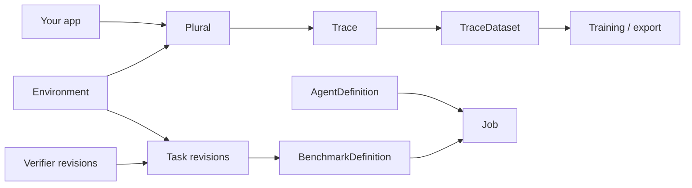

# Plural

**Unified LLM routing with first-class traces, environments, and benchmarks.**

Plural is for builders putting AI into products. Start with an OpenRouter-style multi-provider router. Keep going with the thing OpenRouter does not give you: a single `Trace` object shared by production traffic and RL-style environments — so you can understand prompts, build datasets, run benchmarks, and eventually autoroute to the best model for *your* data.



## Install

```bash
pip install plural
# optional OpenTelemetry exporter
pip install "plural[otel]"
# optional OS keyring / Daytona sandbox provider
pip install "plural[keyring]" "plural[daytona]"
```

## Quickstart

Set `PLURAL_API_KEY`, then use the client like the OpenAI SDK:

```bash
export PLURAL_API_KEY=plural-...
```

```python
from plural import Client, Message

client = Client()
assert client.is_authenticated()
response = client.chat(
    model="openai/gpt-4o-mini",
    messages=[Message(role="user", content="Hello from plural")],
    models=["anthropic/claude-sonnet-4"],  # optional fallbacks
)
print(response.text)
client.close()
# Traces → .plural/traces.jsonl
```

Create or update hosted records with `client.create(x)` and
`client.update(x)`. A project API key already knows the project; an account key
needs `project=` or `PLURAL_PROJECT`.

Optional BYOK (pass your own upstream keys explicitly):

```python
import os
from plural import Client

client = Client(providers={"openai": os.environ["OPENAI_API_KEY"]})
```

## Four pillars

| Pillar | What you get |
| --- | --- |
| **Router** | Sync/async chat + streaming, fallbacks, retries, cost accounting, model catalog |
| **Tracing** | JSONL / SQLite / OTel sinks, redaction, sampling, late labels, attempt history |
| **Environments** | Revisioned actions, typed state/observation, resources, secrets, and runtime placement |
| **Benchmarks** | Ordered Task revisions across one or more Environments |

## Package execution foundation (0.10)

Plural includes a hosted-by-default CLI, an explicit offline/private execution
path, and an immutable schema-v2 execution domain.
Environments own actions, typed hidden state/observation, Rewarders, resources,
secrets, and runtime placement. Tasks and Verifiers are independent revisioned
objects. `AgentDefinition` owns model, instructions, routing, and an optional
Harness without binding to an Environment.

```bash
plural env init environment --name support
plural harness init harness --name support-loop
plural verifier init verifier.yaml --name correct
plural task init task.yaml --id support-1 \
  --environment environment --verifier verifier.yaml
plural benchmark init benchmark.yaml --task task.yaml
plural agent init agent.yaml --model openai/gpt-4o-mini --harness harness
plural job init job.yaml --source benchmark.yaml --agent agent.yaml
plural run job.yaml --mode eval --dry-run
```

Without `--dry-run`, an authenticated `plural run` validates and publishes the
complete revision graph, submits a hosted Job with exact revision IDs, and
follows events. Use `--offline` or `--private` to execute with a durable local
Job store.

Each Task pins one Environment revision and one or more weighted Verifier
revisions. A Job has a discriminated Task-or-Benchmark source and expands
Agents × Tasks × attempts into Trials. Retries append TrialExecutions beneath
the same Trial identity. Human verification produces `awaiting_review`;
append-only progress events can be replayed or watched as JSON.

Execution providers are unsafe local subprocesses (explicit opt-in), hardened
Docker containers, optional Daytona sandboxes, and entry-point plugins.
Unsatisfiable environment requirements fail before any sandbox is created.
Receipts are currently `self_reported` and package signatures are not verified.
In train mode, Rewarders and exact TITO capture are enabled. TITO records include
token IDs, output log probabilities/top log probabilities, text, assistant
message, and validated input/output/observation lengths; records are stored as
hashed artifacts. Eval mode disables Rewarders and TITO while still running
final Verifiers. See the
[CLI docs](https://lastlabs-ai.github.io/plural/cli/), [security
boundaries](https://lastlabs-ai.github.io/plural/operations/security/), and
[known limitations](https://lastlabs-ai.github.io/plural/reference/limitations/).

## Build a revision graph in Python

```python
from plural import (
    AgentBinding, AgentDefinition, DeterministicVerifier, EnvironmentManifest,
    JobSpec, TaskDefinition, TaskJobSource, WeightedVerifier,
)

environment = EnvironmentManifest(name="support-triage")
verifier = DeterministicVerifier(name="correct", command=("python", "verify.py"))
task = TaskDefinition(
    task_id="support-1",
    instructions="Reply with the order status.",
    environment=environment,
    verifiers=(WeightedVerifier(verifier=verifier),),
    info={"order_id": "A100"},
)
job = JobSpec(
    source=TaskJobSource(task=task),
    agents=(AgentBinding(agent=AgentDefinition(name="candidate", model="openai/gpt-4o-mini")),),
)
print(job.plan().trial_count)
```

## Docs

Follow the beginner-to-advanced [documentation](https://lastlabs-ai.github.io/plural/):

- [Install and authenticate](docs/getting-started/setup.md)
- [First offline evaluation](docs/quickstart.md)
- [Practical Python walkthrough](docs/tutorials/sdk-walkthrough.md)
- [Complete CLI walkthrough](docs/tutorials/cli-walkthrough.md)
- [Fetch and update Plural Intel objects](docs/guides/push-to-plural.md)
- [All SDK and CLI features](docs/reference/feature-map.md)

Detailed lifecycle, security, package schemas, and generated command/API
references remain available for advanced integrations.

## Development

```bash
uv sync --group dev --group docs
uv run python scripts/generate_trace_schema.py --check
uv run python scripts/generate_package_schemas.py --check
uv run python scripts/generate_cli_reference.py --check
uv run pytest -m "not live"
uv run ruff check .
uv run mypy src/plural
uv run mkdocs build --strict
```

## License

Apache-2.0
