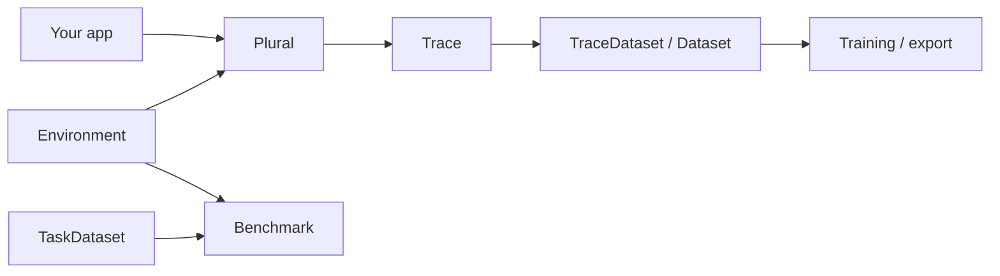

# Plural

**Unified LLM routing with first-class traces, environments, and benchmarks.**

Plural is for builders putting AI into products. Start with an OpenRouter-style multi-provider router. Keep going with the thing OpenRouter does not give you: a single `Trace` object shared by production traffic and RL-style environments — so you can understand prompts, build datasets, run benchmarks, and eventually autoroute to the best model for *your* data.



## Install

```bash
pip install plural
# optional OpenTelemetry exporter
pip install "plural[otel]"
# optional OS keyring / Daytona sandbox provider
pip install "plural[keyring]" "plural[daytona]"
```

## Quickstart

Set `PLURAL_API_KEY`, then use the client like the OpenAI SDK:

```bash
export PLURAL_API_KEY=plural-...
```

```python
from plural import Client, Message

client = Client()
assert client.is_authenticated()
response = client.chat(
    model="openai/gpt-4o-mini",
    messages=[Message(role="user", content="Hello from plural")],
    models=["anthropic/claude-sonnet-4"],  # optional fallbacks
)
print(response.text)
client.close()
# Traces → .plural/traces.jsonl
```

Create or update a hosted environment, trace, or benchmark with
`client.create(x)` and `client.update(x)`. Environments, agents, and
benchmarks are addressed by project-unique slug, so you do not need the
hosted id. Create agents with `client.agents.create(...)`. A project API
key already knows the project; an account key needs `project=` or
`PLURAL_PROJECT`.

Optional BYOK (pass your own upstream keys explicitly):

```python
import os
from plural import Client

client = Client(providers={"openai": os.environ["OPENAI_API_KEY"]})
```

## Four pillars

| Pillar | What you get |
| --- | --- |
| **Router** | Sync/async chat + streaming, fallbacks, retries, cost accounting, model catalog |
| **Tracing** | JSONL / SQLite / OTel sinks, redaction, sampling, late labels, attempt history |
| **Environments** | Versioned `Environment` subclass + tools + scorers → one episode Trace |
| **Benchmarks** | Environment × models → markdown/JSON report with win rates |

## v1 package execution foundation (Alpha)

Plural now includes a local-first CLI and immutable execution domain for
external agent harnesses:

```bash
plural env init environment --name support
plural harness init harness --name support-loop
plural harness add harness --environment environment
plural benchmark init benchmark.yaml --environment environment
plural agent init agent.yaml --model openai/gpt-4o-mini \
  --environment environment --harness harness
plural job init job.yaml --environment environment \
  --benchmark benchmark.yaml --agent agent.yaml
plural run job.yaml --dry-run
```

An Environment owns tasks, instructions, commands/tools, code/source, policy,
limits, and verification. An Agent binds one model to exactly one immutable
HarnessPackage. A Job expands Agents × selected task IDs × `n_attempts` into
stable Trials; retries keep the same Trial identity. Locks, logs, artifacts,
receipts, and results persist under `.plural/jobs`.

Execution providers are unsafe local subprocesses (explicit opt-in), hardened
Docker containers, optional Daytona sandboxes, and entry-point plugins.
Receipts are currently `self_reported` and package signatures are not verified.
Local runs make no hosted writes unless `--sync` is passed; completed results
can be replayed with `plural job upload`. Studio observes uploaded Jobs and
can mark synced records cancelled; it does not launch hosted execution. The
existing SDK Studio APIs continue to support their legacy
Environment/Agent/Benchmark/Trace shapes. See the
[CLI docs](https://lastlabs-ai.github.io/plural/cli/), [security
boundaries](https://lastlabs-ai.github.io/plural/operations/security/), and
[known limitations](https://lastlabs-ai.github.io/plural/reference/limitations/).

## Environments in 30 seconds

```python
from plural import Environment, TaskData

env = Environment(name="support-triage", version="0.1.0")

@env.tool
def lookup_order(order_id: str) -> dict:
    """Look up an order."""
    return {"status": "shipped"}

@env.scorer(weight=1.0)
def ok(rollout) -> float:
    return 1.0 if "shipped" in (rollout.response.text or "").lower() else 0.0

@env.tasks
def tasks():
    yield TaskData(task_id="1", input="Where is order A?")

rollout = env.rollout(next(env.iter_tasks()), client, model="openai/gpt-4o-mini")
print(rollout.trace.outcome)
```

Tool environments use the built-in action dispatch. For scalar or custom text
actions, override `apply_action()` and return `ActionResult`; `step()` remains
framework-owned so lifecycle and trace invariants are always recorded.

## Docs

Full documentation: concept pages, guides, and generated API reference.

- Trace schema stability: `schemas/trace.v1.json`
- Package schemas: `src/plural/schemas/packages/`
- Generated CLI command reference: `docs/reference/cli-commands.md`
- Routing walkthrough: [`examples/routing/`](examples/routing) (also under docs → Guides)

## Development

```bash
uv sync --group dev --group docs
uv run python scripts/generate_trace_schema.py --check
uv run python scripts/generate_package_schemas.py --check
uv run python scripts/generate_cli_reference.py --check
uv run pytest -m "not live"
uv run ruff check .
uv run mypy src/plural
uv run mkdocs build --strict
```

## License

Apache-2.0
