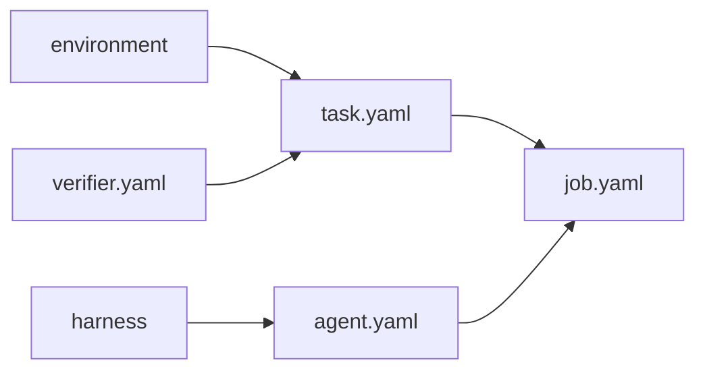

# Getting started

You need Python 3.10 or newer. Docker is optional until you isolate a run. You can finish this page without an account or API key.

```bash
python3 -m venv .venv
source .venv/bin/activate
python -m pip install plural
plural --help
```

If you use `uv`, `uv add plural` and `uv run plural --help` do the same work.



## Scaffold a tiny project

These commands create the same filenames Wordle uses, filled with placeholders you edit.

```bash
plural env init environment --name tickets
plural verifier init verifier.yaml --name correct --kind deterministic
plural task init task.yaml --id ticket-1 \
  --environment environment --verifier verifier.yaml
plural harness init harness --name ticket-loop
plural agent init agent.yaml --name candidate \
  --model openai/gpt-4.1-mini --harness harness
plural job init job.yaml --source task.yaml --source-kind task --agent agent.yaml
```

Open `environment/environment.yaml`. That file is the world: actions, runtime, network, limits. Open `task.yaml`. That file pins the Environment and the Verifier. Open `agent.yaml`. That file is not bound to the Environment.

`plural verifier init` writes a deterministic Verifier that runs `python verify.py`. Add `verify.py` next to `verifier.yaml`. When you run the Job, Plural inlines that file so the sandbox can execute it.

## Run it on your machine

```bash
plural env validate environment
plural task validate task.yaml
plural run job.yaml --offline
```

`--offline` keeps execution and the durable log local under `.plural/jobs`. `--dry-run` plans Trial identities without launching anything.

## When you want hosted

Create a project in Plural Intel, then:

```bash
export PLURAL_API_KEY=...
plural auth login
plural run job.yaml
```

The same files publish as revisions and submit a hosted Job. A project-scoped key only sees that project.

What this unlocks: every later page is an edit to one of these files. [Environments](project/environments.md) is where you replace the placeholder world with yours.
