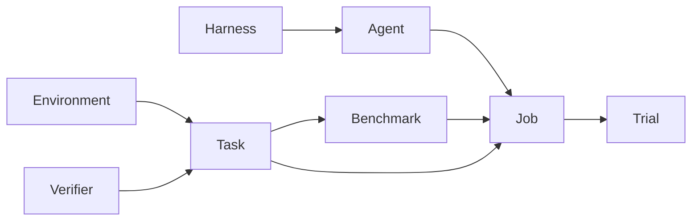

# Core concepts

You author a world, a case, a score, and the models you want to compare.
Plural runs that graph and keeps the record.

Runtime and Resources are part of the Environment, not separate objects. Rewards
belong to the Environment too, and they are not scores: a reward credits one step,
and a Verifier scores a finished Trial.

## Environment

The Environment is the world the Agent is allowed to take action in. It owns:

- **Actions** — the operations the Agent may call.
- **State** — the internal variables that represent the world. The Agent
  never sees State.
- **Observation** — what the Agent is allowed to see, usually returned by
  `reset` and by each action. You choose which facts appear here. Observation
  is not the whole State.
- **Runtime** — where that world executes: `docker` (a sandboxed container),
  `local` (a trusted subprocess on your machine, not a sandbox), or a remote
  provider, plus network settings and compute limits. Changing it changes the
  Environment's content hash.
- **Resources** — the world's filesystem: files and data that are already
  there, shared across Tasks.
- **Rewards** — optional per-step credit, from a `reward()` method or a
  `@rewarder`. Each step's reward is recorded on the episode so you can see
  which action earned the credit. A trainer reads rewards; they never
  contribute to a score and are never shown to the Agent.

These docs use the game Wordle as a running example, and a support-ticket
queue when we need a second world. One Environment can host many Tasks: Wordle
is the game; each secret word is a Task. The support queue is the desk; each
ticket is a Task.

The Environment can also declare the *names* of secrets it needs. Their values
are supplied when a Trial runs and are never stored in the project.

See [Environments](../project/environments.md).

## Task

A Task is one unit of work in an Environment. It has instructions, optional
goals, one Environment, and one or more Verifiers that score it.

You can set Environment State from the Task (`initial_state`) and attach
case-specific files (Task resources). Task resources are staged for that Trial
only, then discarded. Reusable world behavior stays on the Environment;
case-specific facts belong on the Task.

See [Tasks](../project/tasks.md).

## Verifier

A Verifier scores a completed Trial: one Agent run in an Environment. It
reads the Agent's trajectory and the State and Observation updates from that
episode. It does not score the Environment itself.

Three kinds:

- **DeterministicVerifier** — a function over an `Episode` (observation,
  state, trajectory, artifacts, usage). Use this when the score is exact.
- **AgentVerifier** — a catalog model that judges the episode against
  criteria.
- **HumanVerifier** — a rubric for a person to score after the Trial.

See [Verifiers](../project/verifiers.md).

## Agent

An Agent is instructions, a catalog model, and an optional Harness. With no
Harness, it uses `native`, Plural's built-in tool loop. It is not bound to an
Environment. The
same Agent can play Wordle in one Job and triage tickets in another, including
after you train a replacement model and point the Agent at it.

The Agent takes actions in an Environment to work toward a goal — reasoning
under uncertainty. It sees only the Task instructions and the Environment's
Observations: scores, rewards, termination flags, and private Verifier data
never reach its context.

Model credentials do not live on the Agent. A model call needs an API key from
`plural auth login --api-key-stdin` or `PLURAL_API_KEY`, or your own
`OPENAI_API_KEY` for OpenAI models. A browser login is not accepted for model
calls. The SDK also accepts `client=` or `api_key=` on the Job. An Agent whose
Harness calls no model can declare `auth_mode: none` and runs without any
credential.

See [Agents](../project/agents.md).

## Harness

A Harness is the loop that connects an Agent to an Environment: how it
manages context, which extra tools it offers, and when it stops. An Agent with
no Harness uses `native`. You can also name a built-in Harness such as
`claude-code` or `codex`, or write your own in `harnesses/`. A Harness can
also skip the model entirely, like the keyword Harness in the
[support queue tutorial](../tutorials/support-queue.md). An Environment's
`harness_policy` may remove capabilities (for example, network access) from
whatever the Harness requests.

See [Harnesses](../project/harnesses.md).

## Benchmark

A Benchmark is a versioned, ordered collection of Tasks plus the rules for
ranking results. Every run pins the exact Task, Environment, and Verifier
content it used, so later comparisons stay the same experiment.

A Benchmark run scores each Agent using the Task Verifiers, and records
latency, cost, and how stable those scores are across attempts. Results rank
on the Verifier score only; step rewards never contribute. Change a Task,
Environment, or Verifier and give the Benchmark a new version.

See [Benchmarks](../project/benchmarks.md).

## Job

A Job is how you run a Task or a Benchmark. It holds the Agents, the number
of attempts, concurrency, and whether the run is **eval** or **train**.

Eval is the default, and it is what `plural run` does: score the Agent and
keep the episode record. Train, set with `Job(..., mode="train")` in Python,
runs the same Tasks and also captures the exact tokens in and out, so a
downstream trainer can consume the episodes with their rewards. Rewards are
recorded in both modes. Neither mode updates model weights inside Plural.

Every `plural run` is a new Job. Plural records it under
`.plural/jobs/<job-id>/` with each input pinned by version and content
hash, so `plural job rerun` repeats it with exactly those inputs rather than
your current files. A Job that calls a model needs a credential; a dry run
does not.

See [Jobs](../running/jobs.md).

## Trial

A Trial is one Agent × one Task × one planned attempt. A Job expands into
Trials. A timeout can retry as another *execution* of the same Trial; the
Trial identity does not change.

Each execution records a trajectory, artifacts, logs, and a receipt of the
exact inputs it used. The Task's Verifiers write the score. A HumanVerifier
pauses the Trial at `awaiting_review` until someone submits a score.

See [Trials](../running/trials.md).

## Projects and revisions

You keep these objects in a project: a directory with a `project.yaml` and
one subdirectory per resource, such as `environments/support-queue/` or
`tasks/ticket-1/`. Resources refer to one another by name. The `plural` CLI
addresses them by kind and name (`plural task validate ticket-1`), and the
Python SDK loads the same resources with `plural.project.Workspace`.

Runs are local by default. To run on hosted infrastructure, you push
resources to a private hosted project. Each push creates an immutable
revision, or reuses the existing one when the content has not changed, and
the revision is available in that project immediately. Pushing never makes
anything public; sharing is a separate action in the Plural web app.

When you are ready to install and authenticate, open
[Getting started](../getting-started.md).
