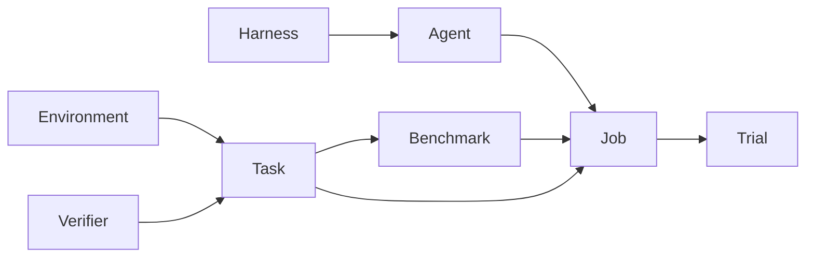

# Core concepts

You author a world, a case, a score, and the models you want to compare.
Plural runs that graph and keeps the record.

Runtime and Resources are nested inside the Environment, not separate objects.
Rewarders are nested inside the Environment too, and they are not Verifiers:
Rewarders emit a train-only signal, Verifiers score a finished Trial.

## Environment

The Environment is the world the Agent is allowed to take action in. It owns:

- **Actions** — the operations the Agent may call.
- **State** — the internal variables that represent the world. The Agent
  never sees State.
- **Observation** — what the Agent is allowed to see, usually returned by
  `reset` and by each action. You choose which facts appear here. Observation
  is not the whole State.
- **Runtime** — where that world executes: the machine image, network
  settings, and compute placement. Changing it changes the Environment hash.
- **Resources** — the world's filesystem: files and data that are already
  there, shared across Tasks.
- **Rewarders** — optional train-only signals over state transitions. They
  feed downstream training data; they never score an evaluation.

These docs use the game Wordle as a running example, and a support-ticket
queue when we need a second world. One Environment can host many Tasks: Wordle
is the game; each secret word is a Task. The support queue is the desk; each
ticket is a Task.

The Environment can also declare secret *names*. Values are supplied at
execution time; they are not stored on the object.

See [Environments](../project/environments.md).

## Task

A Task is one unit of work in an Environment. It has instructions, optional
goals, one Environment, and one or more Verifiers. The Environment must be
runnable and each Verifier must be able to score an Episode.

You can set Environment State from the Task (`initial_state`) and attach
case-specific files (Task resources). Task resources are staged for that Trial
only, then discarded. Reusable world behavior stays on the Environment;
case-specific facts belong on the Task.

See [Tasks](../project/tasks.md).

## Verifier

A Verifier scores a completed Trial: one Agent run in an Environment. It
reads the Agent's trajectory and the State and Observation updates from that
episode. It does not score the Environment itself.

Three kinds:

- **DeterministicVerifier** — a function over an `Episode` (observation,
  state, trajectory, artifacts, usage). Use this when the score is exact.
- **AgentVerifier** — a catalog model that judges the episode against
  criteria.
- **HumanVerifier** — a rubric for a person to score after the Trial.

See [Verifiers](../project/verifiers.md).

## Agent

An Agent is instructions, a catalog model, and an optional Harness. Omit the
Harness to use Plural's native loop. It is not bound to an Environment. The
same Agent can play Wordle in one Job and triage tickets in another, including
after you train a replacement model and point the Agent at it.

The Agent takes actions in an Environment to work toward a goal — reasoning
under uncertainty. Model authentication lives on the Job (`client=` or
`api_key=`), not on the Agent.

See [Agents](../project/agents.md).

## Harness

A Harness is how the Agent manages context as it works in the Environment:
the interaction loop plus the extra tools it may use. Omit it to use Plural's
native loop. An Environment policy may subtract capabilities (for example,
network access) from whatever the Harness requests.

See [Harnesses](../project/harnesses.md).

## Benchmark

A Benchmark is an immutable, versioned, ordered collection of Tasks. Agents
run against that pin so later comparisons stay the same experiment.

A Benchmark run scores each Agent using the Task Verifiers, and records
latency, cost, and how stable those scores are across attempts. Change a
Task, Environment, or Verifier and mint a new Benchmark version.

See [Benchmarks](../project/benchmarks.md).

## Job

A Job is how you run a Task or a Benchmark. It holds the Agents, the number
of attempts, concurrency, and whether the run is **eval** or **train**.

Eval is the default: score the Agent and keep the episode record. Train uses
the same graph and adds training-grade capture (exact tokens in and out, plus
Environment rewarders when you declare them). Use train when you want data
for a downstream trainer. Neither mode updates model weights inside Plural.

A live Job needs `Job(..., client=Client())` or `api_key=`. Dry-run does not.

See [Jobs](../running/jobs.md).

## Trial

A Trial is one Agent × one Task × one planned attempt. A Job expands into
Trials. A timeout can retry as another *execution* of the same Trial; the
Trial identity does not change.

Each execution records a trajectory, artifacts, logs, and a receipt. Final
Verifiers write the score. A human Verifier pauses the Trial at
`awaiting_review`.

See [Trials](../running/trials.md).

When you are ready to install and authenticate, open
[Getting started](../getting-started.md).
