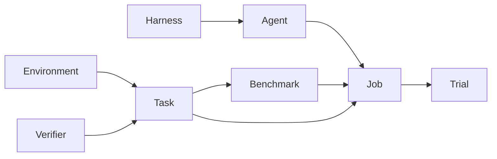

# Core concepts

Plural has a small vocabulary. Once these few words click, the rest of the docs falls
into place. We use two running examples throughout:

- **Wordle.** The game is the world. Each secret word is one assignment.
- **A support ticket queue.** The help desk is the world. Each ticket is one
  assignment.

## The big picture

Evaluating an AI is a lot like setting an exam. You need a place where the work
happens, the questions, someone to mark the answers, and the people sitting the exam.
Plural gives each of those a name.

| Everyday idea | In Plural | Wordle example |
| --- | --- | --- |
| The world | **Environment** | The Wordle game |
| One assignment | **Task** | "The secret word is CRANE" |
| The grader | **Verifier** | Did the Agent guess the word? |
| The contestant | **Agent** | A model plus its instructions |
| How the contestant plays | **Harness** | The loop that picks the next guess |
| The exam | **Benchmark** | Three Wordle games with a leaderboard |
| One sitting of the exam | **Job** | "Run these Agents on this Benchmark" |
| One attempt | **Trial** | One Agent playing one game once |

Here is how they connect:

```mermaid
flowchart LR
  env[Environment]
  ver[Verifier]
  task[Task]
  agent[Agent]
  harness[Harness]
  bench[Benchmark]
  job[Job]
  trial[Trial]
  env --> task
  ver --> task
  task --> bench
  harness --> agent
  agent --> job
  bench --> job
  task --> job
  job --> trial
```

The rest of this page explains each one.

## Environment

An **Environment** is the world the AI is allowed to act in. It decides what the
Agent can do, what it can see, and what is really going on behind the scenes.

In Wordle, the Environment is the game: you can submit a guess, and after each guess
you see which letters are green, yellow, or gray. The secret word itself is hidden.

Every Environment has:

- **Actions**: the moves the Agent can make, like `guess` in Wordle or `refund` at the
  help desk.
- **State**: the full truth about the world, including things the Agent must not see,
  such as the secret word. The Agent never sees State.
- **Observation**: the part of the world the Agent is shown, like the colored tiles.
  You decide exactly what goes here.
- **Runtime**: where the world runs. Usually that is `docker`, a sealed container on
  your machine. There is also `local`, which runs directly on your computer and should
  only be used for code you trust, and hosted options.
- **Resources**: files that are already in the world, like a word list or a policy
  document, shared by every Task.
- **Rewards** (optional): small bits of credit for individual moves, used when you
  train a model. Rewards are *not* scores. They never count toward a result and the
  Agent never sees them.

One Environment can host many Tasks. The Wordle game hosts one Task per secret word.
An Environment can also say which *secrets* it needs, such as an API key for a tool.
Only the names are stored; the values are supplied when a run starts.

See [Environments](../project/environments.md).

## Task

A **Task** is one assignment in an Environment. It has:

- **Instructions**: what the Agent should accomplish, in plain language.
- **The Environment** it happens in.
- **One or more Verifiers** that grade it.

A Task can also set up the world before the Agent starts, for example by choosing the
secret word (`initial_state`), and it can bring its own files, like the specific
ticket a customer sent. Those files exist only for that attempt and are cleaned up
afterwards.

A good rule of thumb: how the world *works* belongs on the Environment; the facts of
*this particular case* belong on the Task.

See [Tasks](../project/tasks.md).

## Verifier

A **Verifier** is the grader. When an attempt finishes, the Verifier looks at what
happened and gives it a **score**, usually between 0 and 1.

It can see everything: every step the Agent took, the hidden State, and any files the
Agent produced. The Agent, on the other hand, never sees the Verifier or its score.

There are three kinds of grader:

- **Deterministic**: a small piece of code that checks the answer exactly. "Did the
  Agent guess CRANE?" Use this whenever the right answer is clear-cut.
- **Agent (AI judge)**: a model that judges the work against written criteria. Useful
  for things like "was the reply polite and accurate?"
- **Human**: a rubric that a person fills in after the attempt. The attempt waits for
  their score.

The score is the only thing Plural ranks on.

See [Verifiers](../project/verifiers.md).

## Agent

An **Agent** is a contestant: a model from the catalog plus the instructions you give
it, and optionally a Harness.

Agents are not tied to one world. The same Agent can play Wordle in one run and work
support tickets in the next. That makes comparisons fair: you are testing the Agent,
not a version of it tailored to the test.

An Agent only ever sees two things: the Task's instructions and the Environment's
Observations. It never sees the score, the rewards, the hidden State, or anything the
Verifier knows.

Every model call goes through the Plural gateway, which bills it at the provider's
price. That is why a real run needs a **Plural API key**. `plural auth login` stores
one for you: it mints a 30-day key for the account you approve it from. You can also
create one in the web app under Keys, then store it with
`plural auth login --api-key-stdin` or put it in the `PLURAL_API_KEY` environment
variable. An Agent that never calls a model, like a scripted one, can declare
`auth_mode: none` and needs no key at all.

See [Agents](../project/agents.md).

## Harness

A **Harness** is *how* the Agent plays. It is the loop that shows the model what it
can see, asks it what to do, performs the action, and repeats until the work is done.

Most of the time you don't need to think about it: an Agent without a Harness uses
`native`, Plural's built-in loop. You can also pick a well-known one such as
`claude-code` or `codex`, or write your own. A Harness doesn't even have to use a
model. The [support queue tutorial](../tutorials/support-queue.md) uses a simple
keyword-matching Harness so you can try Plural offline.

An Environment can limit what any Harness is allowed to do, for example by turning off
internet access. That limit is its `harness_policy`.

See [Harnesses](../project/harnesses.md).

## Benchmark

A **Benchmark** is the exam: a fixed, ordered set of Tasks and the rules for ranking
the results. Run several Agents on it and you get a leaderboard for your own work.

Each Agent is ranked by its Verifier scores, alongside how much it cost, how long it
took, and how consistent it was across repeated attempts. Rewards never affect the
ranking.

Benchmarks are versioned. When you change a Task, its Environment, or its Verifier,
you give the Benchmark a new version, so an old result is never quietly compared
against a different test.

See [Benchmarks](../project/benchmarks.md).

## Job

A **Job** is one run that you start: "run these Agents on this Task" or "run these
Agents on this Benchmark". It also says how many attempts to make and how many to run
at once.

Jobs come in two modes:

- **Eval** (the default, and what `plural run` does): grade the Agents and keep the
  record.
- **Train**: the same run, but it also captures the exact text sent to and received
  from the model, so a training system can learn from the attempts along with their
  rewards. Set it in Python with `Job(..., mode="train")`. Plural itself never changes
  a model's weights.

Every Job pins the exact version of everything it used. That is what makes
`plural job rerun` possible: it repeats the Job with the same inputs, even if you have
edited your files since. On your machine, Job records live in `.plural/jobs/`.

See [Jobs](../running/jobs.md).

## Trial

A **Trial** is one attempt: one Agent, one Task, one try. A Job with three Agents,
ten Tasks, and two attempts each becomes sixty Trials.

Each Trial keeps a complete record: every step the Agent took (its *trajectory*), the
files it produced (*artifacts*), logs, cost, timing, and a receipt of the exact inputs
it used. The Verifiers then write the score. If a Task uses a human grader, the Trial
waits in `awaiting_review` until someone submits a score.

If a Trial times out and is retried, the retry is another *execution* of the same
Trial, so the Trial count in your results stays honest.

See [Trials](../running/trials.md).

## Projects and revisions

All of these live together in a **project**. On your computer, a project is a folder
with a `project.yaml` file and one subfolder per resource, such as
`environments/wordle/` or `tasks/crane/`. Resources refer to each other by name, and
the `plural` command-line tool and the Python SDK both read the same folder.

Runs happen on your machine by default. To have Plural run them for you, you **push**
resources to a private hosted project. Each push saves an unchangeable snapshot called
a **revision**. Pushing the same content twice reuses the existing revision. Pushing
never makes anything public; sharing on the Hub is a separate step you take in the web
app.

Ready to try it? Head to [Getting started](../getting-started.md).
