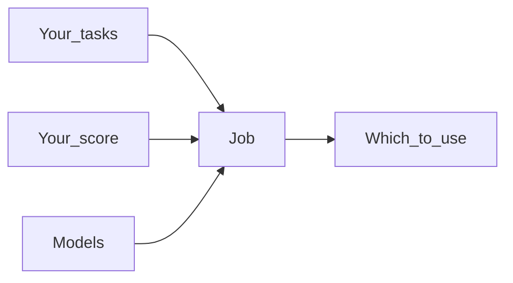

# Know which model to use on your work

A public ranking cannot tell you which model to put on your tickets, your checkout, or your policy. Those tasks are yours. Plural is how you measure models against them, keep the record, and pick one with evidence.

When the next model ships, you do not start over. You run the same tasks, with the same definition of success, and you see what changed.

That scoreboard is four objects you will see on every later page.

1. A **Task** is one piece of work you care about.
2. A **Verifier** is what counts as success on that work.
3. An **Agent** is a model you want to try, plus the instructions it gets.
4. A **Job** runs those Agents on those Tasks and writes a **Trace** you can inspect.

Start here, then build the scoreboard, then run it.

1. [Motivation](motivation.md) — why a public ranking is the wrong default.
2. [Getting started](getting-started.md) — install and run a scored Job on your machine.
3. [Environments](project/environments.md) through [Benchmarks](project/benchmarks.md) — the objects that make the scoreboard yours.
4. [Jobs](running/jobs.md), [Traces](running/traces.md), and [Reviews](running/reviews.md) — how you compare and decide.

When you want a complete worked example, walk [Wordle](tutorials/wordle.md). It uses the same filenames `plural env init` creates.
