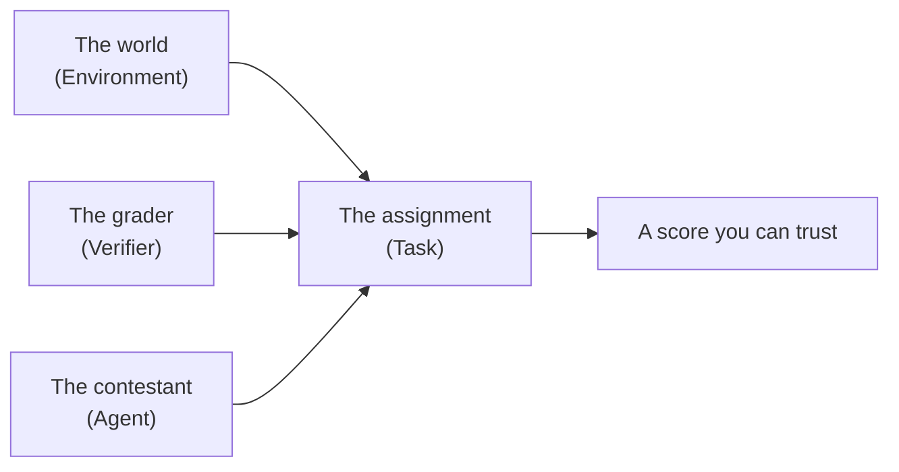

# Plural

Plural helps you answer a simple question that turns out to be hard: **which AI is
good at the work *you* care about?**

Public leaderboards test models on someone else's problems. Your work is different.
It has its own tools, its own rules, and its own idea of what "done well" means.
Plural lets you describe that work once, run any model against it, and see honest,
repeatable results.

## Why we built it

We think [intelligence should be plural](https://lastlabs.ai/blog/intelligence-should-be-plural).
Not one brain with a billion prompts. Different people and companies have different
goals, values, and ways of seeing the world, and that is a feature.

If an organization spent twenty years learning how it makes decisions, some of that
should become learned behavior in *its* model. The model should get better at being
their model. Getting there starts with three questions:

1. **Which models are good at the work we care about?**
2. **Which model should we use for each task?**
3. **How do we improve further when none of them is good enough yet?**

Plural turns those into three steps: **evaluate**, **route**, and **train**.

## How it works, in one minute

Think of it like setting an exam for AI.

```mermaid
flowchart LR
  world["The world<br/>(Environment)"]
  work["The assignment<br/>(Task)"]
  grader["The grader<br/>(Verifier)"]
  contestant["The contestant<br/>(Agent)"]
  result["A score you can trust"]
  world --> work
  grader --> work
  contestant --> work
  work --> result
```

- You describe **the world** the AI works in, such as a game of Wordle or a support
  ticket queue. That is an **Environment**.
- You write **the assignment**, such as "guess the word CRANE" or "refund this
  customer". That is a **Task**.
- You decide **how the work is graded**. That is a **Verifier**.
- You pick **the contestants**: a model plus its instructions. Each one is an
  **Agent**.

Plural runs each Agent on each Task, grades the result, and keeps a full record of
what happened: every step the AI took, what it cost, how long it took, and the exact
version of everything involved. Group Tasks into a **Benchmark** and you get a
leaderboard for your own work.

## Evaluate, route, train

**Evaluate.** Run the models you are considering against your own Tasks and compare
them on the same test. Because every input is recorded exactly, you can rerun a
result months later and get the same experiment.

**Route.** Once you trust the scores, send each kind of work to the cheapest model
that does it well. Sometimes that is a frontier model. Sometimes it is a small
specialist. There is no single best model, only the best one for a goal and a budget.
The [model catalog](https://pluralintel.com/models) lists every model Plural can
reach, with prices, and one Plural API key calls any of them.

**Train.** When the best model available still is not good enough, the same
Environments and Tasks become training material. Plural does not replace your
training setup. It gives it versioned work, honest scores, and exact records of every
attempt.

## Where your work lives

Everything you build lives in a **project**. On your computer, a project is a folder
with one subfolder per Environment, Task, Verifier, Agent, and so on. In the web app
at [pluralintel.com](https://pluralintel.com), the same project shows up in the
project switcher at the top of the sidebar.

Runs happen on your own machine by default, which costs nothing but the model calls.
When you want Plural to run things for you, you push the project to a private hosted
project. Nothing you push is ever public unless you choose to publish it.

## Where to go next

- New here? Read [Core concepts](getting-started/concepts.md). It takes about five
  minutes and explains every word above.
- Ready to try it? [Getting started](getting-started.md) walks you from sign-up to
  your first scored run.
- Want to see a finished project first? The
  [support queue tutorial](tutorials/support-queue.md) runs completely offline, with
  no account or key.
- Upgrading from 0.14? Read [Migrate to 0.15](migration/projects.md).
