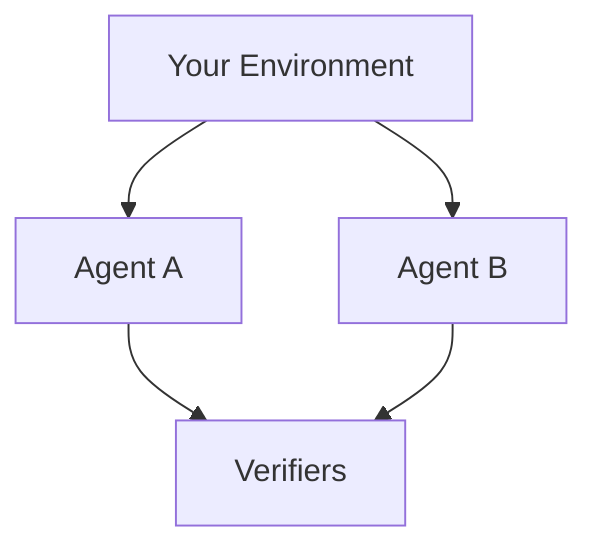

# Why Plural exists

Most stacks start with a model and hope the rest of the product will fit around it. That works until the work is yours: a ticket queue, a game, a checkout flow, a policy that cannot leak. Then the model is the easy part. The hard part is the world it is allowed to touch and the score you will believe.

Plural starts from that world.

An **Environment** is the place an episode happens. It owns the actions, the State (never shown to the Agent), the Observation (the only part the Agent sees), and the Runtime where it runs. Nothing on the Agent side can rewrite it.

A **Task** is one piece of work in that world: instructions, the Environment it runs in, and the **Verifiers** that score it. The Verifiers decide whether the episode counted. They are not the Agent, and they are not the world.

An **Agent** is a model, instructions, and an optional **Harness**, the loop that connects the model to the Environment. It is not bound to an Environment. The same Agent can work a ticket queue today and a Wordle board tomorrow.

A **Job** is how you run that setup: one Task or a **Benchmark** of Tasks, one or more Agents, as many attempts as you want. Each Agent's attempt at a Task is a **Trial**, which keeps the trajectory, the artifacts, and the score. When a person has to judge the result, the Trial waits for a **Review**.

What this unlocks: you can change the model without rewriting the world, change the score without rewriting the Agent, and pin every input so a later run is the same experiment.

Next, read [Core concepts](getting-started/concepts.md) for each object in detail, then [Getting started](getting-started.md) to install Plural and run a Task.
