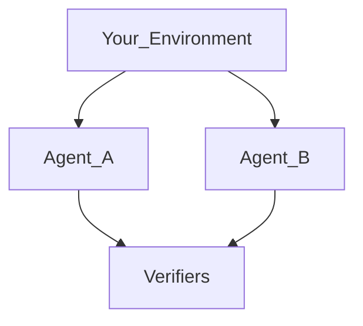

# Why Plural exists

Most stacks start with a model and hope the rest of the product will fit around it. That works until the work is yours: a ticket queue, a game, a checkout flow, a policy that cannot leak. Then the model is the easy part. The hard part is the world it is allowed to touch and the score you will believe.

Plural starts from that world.

An **Environment** is the place an episode happens. It owns actions, hidden state, what the Agent may see, and where the Trial runs. You cannot rewrite it from the Agent side.

A **Task** is one piece of work in that world: instructions, public info, one pinned Environment revision, and weighted **Verifiers**. The Verifiers decide if the episode counted. They are not the Agent, and they are not the world.

An **Agent** is a model, instructions, and an optional **Harness** that wraps the LLM. It is not bound to an Environment. The same Agent can sit a Task in a ticket world today and a Wordle board tomorrow.

A **Job** is how you run that graph: one Task or a **Benchmark** of Tasks, one or more Agents, as many attempts as you want. Eval mode scores. Train mode can also emit Rewarders. Either way you get a **Trace** — the episode — and, if a human has to look, a **Review**.

What this unlocks: you can change the model without rewriting the world, change the score without rewriting the Agent, and keep every revision so a later run is the same experiment.
