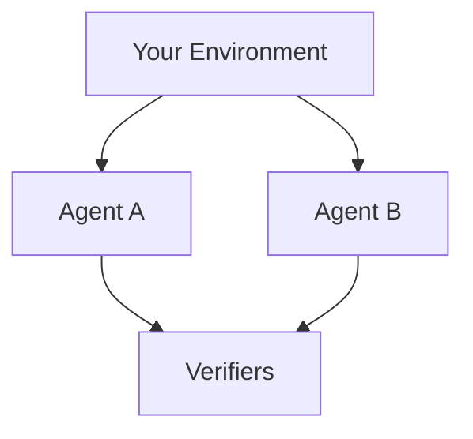

# Why Plural exists

There is no single best AI model you can buy for your work. There is only the model
that does *your* work well, at a price you are happy with. Plural exists to help you
find it, and to keep finding it as models change.

## The model is the easy part

Most AI projects start with a model and hope the rest of the product fits around it.
That works for general questions. It stops working when the work is yours: a support
ticket queue, a game, a checkout flow, a policy that must never leak.

At that point, picking a model is the easy part. The hard parts are:

- **The world it is allowed to touch.** Which tools can it use? What can it see, and
  what must stay hidden?
- **A score you will believe.** How do you know whether it actually did the job, and
  rather than only claiming it did?

Plural starts from those two things, and treats the model as something you swap in and
out.

## Keep the world, the grader, and the contestant apart

Think of it as an exam. The exam hall and its rules stay the same, the marking scheme
stays the same, and different contestants sit it. That is what makes the results fair.

```mermaid
flowchart TB
  world["Your Environment"]
  agentA["Agent A"]
  agentB["Agent B"]
  score["Verifiers"]
  world --> agentA
  world --> agentB
  agentA --> score
  agentB --> score
```

Plural gives each part its own name, so no part can quietly change another.

**The world is the Environment.** It is the place an episode happens. It owns the
actions the AI can take, the **State** (the full truth, never shown to the Agent), the
**Observation** (the only part the Agent sees), and the **Runtime** where it runs.
Nothing on the Agent's side can rewrite it.

**The assignment is a Task.** It is one piece of work in that world: the instructions,
the Environment it runs in, and the **Verifiers** that score it.

**The grader is a Verifier.** Verifiers decide whether the episode counted. They are
not the Agent, and they are not the world.

**The contestant is an Agent.** It is a model, its instructions, and an optional
**Harness**, the loop that connects the model to the Environment. An Agent is not tied
to one Environment. The same Agent can work a ticket queue today and a Wordle board
tomorrow.

**The run is a Job.** A Job runs that setup: one Task, or a **Benchmark** of Tasks,
with one or more Agents and as many attempts as you want. Each Agent's attempt at a
Task is a **Trial**, which keeps the trajectory (every step the Agent took), the
artifacts (the files it produced), and the score. When a person has to judge the
result, the Trial waits for a **Review**.

## What the separation gives you

Because the parts are separate, you can:

- **change the model without rewriting the world,**
- **change how work is graded without rewriting the Agent,** and
- **pin every input,** so a run months from now is the same experiment.

That is what turns "this model seemed good" into a result you can compare, repeat,
and trust.

## Where to go next

Read [Core concepts](getting-started/concepts.md) for each part in detail, then
[Getting started](getting-started.md) to install Plural and run a Task.
