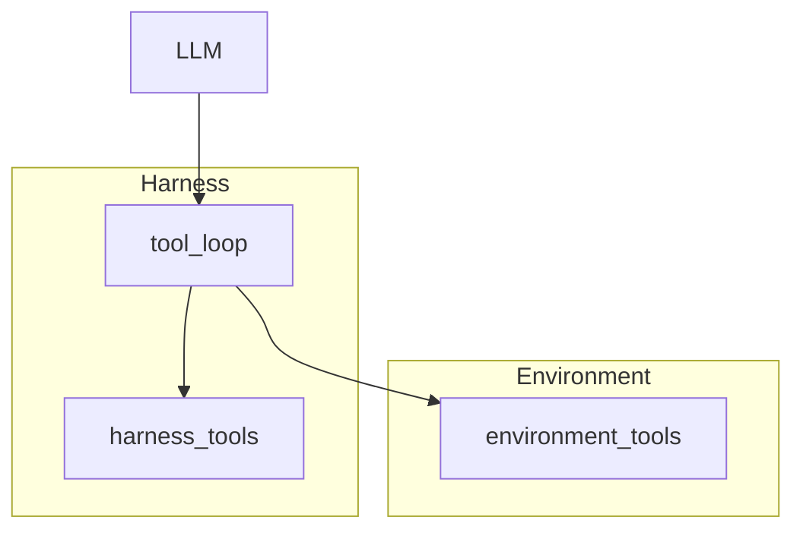

# Agents

An Agent is who takes a turn. Model, instructions, routing, optional Harness. No Environment identity lives on the Agent. The Job places that Agent inside the Task's Environment for one Trial.

```bash
plural harness init harness --name ticket-loop
plural agent init agent.yaml --name candidate \
  --model openai/gpt-4.1-mini --harness harness
```

```yaml
name: wordle-solver
model: offline/wordle-solver
instructions: >-
  Play Wordle. Start with a strong opener, then only guess words that
  remain consistent with every mark on the board.
auth_mode: none
```

Wordle ships two Agents that share one offline Harness. The Harness reads the Agent name and picks a constraint solver or a fixed guess list. Neither Agent file mentions Wordle's Environment.



## The Harness wraps the LLM

A Harness is the loop around the model: tools, retries, how it talks to Environment actions. Environment actions show up as `environment.reset` and `environment.guess`. Harness-owned tools show up as `harness.web_search`.

The Environment may deny harness tools. A denial is soft: the model gets a reason and can try something else. Environment actions are not denied this way. They belong to the world.

Declared versus runnable: a declared Harness is a contract without a command. A runnable Harness is a package with `harness.py` and `harness.yaml`. `plural harness init` writes the runnable shape.

## A Trial

When a Job runs, one Trial is one Agent × one Task × one attempt. Plural stages the Environment, starts the Harness, then runs the Task's Verifiers. The Agent never receives hidden state. Capability denials, if any, land on the Trial receipt.

What this unlocks: you can keep the same Agent and point a Job at a different Task. Next, [group Tasks into a Benchmark](benchmarks.md).
