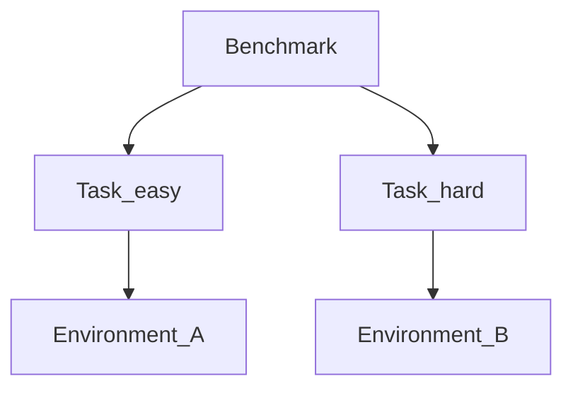

# Benchmarks

A Benchmark is an ordered list of Tasks. That is the whole object. It does not run anything. A Job does.

```bash
plural benchmark init benchmark.yaml --name support-suite \
  --task task.yaml --task another-task.yaml
```

```yaml
schema_version: "2"
name: wordle-suite
revision: "1.0.0"
primary_metric: reward
tasks:
  - tasks/easy-01.yaml
  - tasks/easy-02.yaml
  - tasks/medium-01.yaml
  - tasks/medium-02.yaml
  - tasks/hard-01.yaml
```



Tasks may pin different Environment revisions. That is how you compare one Agent across two worlds, or two worlds that share Verifiers.

A Benchmark is not a public leaderboard. It does not rank models for you. `primary_metric` is the name you want reports to highlight — usually `reward`.

What this unlocks: `plural run benchmark.yaml --agent agents/solver.yaml --offline` expands to Agents × Tasks × attempts. [Jobs](../running/jobs.md) is that expansion.
