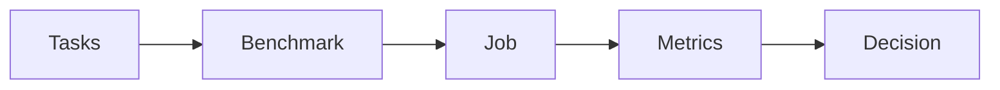

# Benchmarks

A Benchmark is a versioned collection of Tasks. It pins the cases you care about so every Agent is measured on the same work.

You do not score a Benchmark by hand. You create the collection, run a Job against it, then read four metrics: correctness, consistency, latency, and cost. The usual decision is a Pareto of cost and correctness: keep the agents that are accurate enough, then prefer the cheaper ones.



## Create a Benchmark

Start from Tasks you already have. Each Task is one case: instructions, an Environment, and the Verifiers that define success. See [Tasks](tasks.md) if you still need to write those cases.

```python
from plural import Agent, Benchmark, Job

benchmark = Benchmark(
    name="support-triage",
    version="1.0.0",
    description="Categorize, answer, and resolve common support requests.",
    tasks=[ticket_1, ticket_2, ticket_3],
)

careful = Agent(
    name="careful",
    model="openai/gpt-5.6-luna",
    instructions="Read the ticket and policy before assigning a category.",
)
concise = Agent(
    name="concise",
    model="openai/gpt-5.6-luna",
    instructions="Complete the ticket using the available actions. Be concise.",
)

job = Job(benchmark, agents=[careful, concise], attempts=2, concurrency=2)
```

That is the whole setup: group the Tasks, choose the Agents, and attach them to a Job. Task names must be unique. The version is required; every saved version is a release, and a release never changes.

### Save a Benchmark in a project

In a project, a Benchmark is a directory under `benchmarks/` named after it, holding `benchmark.yaml` and a required `README.md` that explains what the Benchmark measures. Create one and add Tasks by name:

```bash
plural benchmark init support-triage
plural benchmark add ticket-1 --benchmark support-triage
plural benchmark add ticket-2 --benchmark support-triage
plural benchmark add ticket-3 --benchmark support-triage
```

`plural benchmark add` and `plural benchmark remove` edit the `tasks` list in `benchmark.yaml` and keep its comments. Both are local edits until you push. This is `benchmarks/support-triage/benchmark.yaml` from the [first project](../tutorials/first-project.md):

```yaml
name: support-triage
version: 1.0.0
description: Categorize and resolve support tickets according to policy.
purpose: >-
  Measures whether an Agent reads a ticket and its policy, routes it to the
  right team, and closes it with a reply, which is the core of support triage.
tasks:
  - ticket-1
  - ticket-2
  - ticket-3
scoring:
  metric: Correctly triaged tickets
  description: Share of tickets resolved with the expected category and a drafted reply.
  aggregation: weighted_mean
  score_range: [0.0, 1.0]
  success_threshold: 1.0
  agent_failure: zero
  infrastructure_error: exclude
```

`name` must match the directory name, and each entry in `tasks` names a Task in `tasks/`. Validation requires a `README.md`, a `purpose`, a `scoring.description`, and at least one Task. The release fields in the next section, such as `categories` and `tracks`, are written in `benchmark.yaml` with the same names and nesting as the Python arguments.

```bash
plural benchmark validate support-triage
plural benchmark push support-triage --with-deps
```

`validate` checks the Benchmark and every Task, Environment, and Verifier it depends on. `push` saves an immutable, private revision; `--with-deps` also pushes dependencies that are not hosted yet. Pushing unchanged content reuses the existing revision, and a changed file under an unchanged `version` is refused. To use the saved Benchmark from Python, load it with `Workspace(Project.find()).get("benchmark", "support-triage")` from `plural.project`.

`primary_metric` defaults to `score`. That is the correctness score written by each Task's Verifiers. Leave it as `score` unless you have a named Verifier score you want to rank on.

Choose cases that represent the decisions you need to make. For customer support, include billing, technical, and account requests, then add the difficult ones that matter to your product. A small set checks that evaluation works; a representative set is what you use to choose an agent.

## Declare what a release measures

A release can say what it measures, how its score is built, and which comparisons are fair. All of these fields are optional; a Benchmark without them still runs, but it cannot rank results officially until it declares a track.

```python
from plural import Benchmark, BenchmarkCategory, BenchmarkScoring, EvaluationTrack

benchmark = Benchmark(
    name="support-triage",
    version="1.1.0",
    tasks=[ticket_1, ticket_2, ticket_3],
    purpose="How reliably an Agent resolves common support requests end to end.",
    success="The ticket is categorized, answered, and resolved according to policy.",
    limitations=["English tickets only.", "No phone or chat channels."],
    license="CC-BY-4.0",
    categories=[
        BenchmarkCategory(id="billing", name="Billing", tasks=["ticket-1", "ticket-2"]),
        BenchmarkCategory(id="technical", name="Technical", tasks=["ticket-3"]),
    ],
    scoring=BenchmarkScoring(task_weights={"ticket-3": 2}),
    tracks=[
        EvaluationTrack(
            id="controlled",
            name="Controlled",
            kind="models",
            instructions="none",
            attempts=2,
            description="Built-in loop, no extra instructions, two attempts.",
        ),
        EvaluationTrack(id="open", name="Open systems", kind="agents"),
    ],
    default_view="models",
)
```

- **Categories** group Tasks so results can be read per category. Their ids are stable; keep them when you rename. A category only means something inside its Benchmark: two Benchmarks' "Billing" scores are not comparable.
- **Scoring** declares the score range, the success threshold, Task weights, how much coverage an entry needs to rank, and whether Agent failures count as zero or are excluded.
- **Tracks** are versioned comparison rules: attempts, retries, allowed harnesses, instructions, tools, inference settings, and turn, time, and cost limits. A **Models** track holds everything but the model constant. An **Agents** track compares complete systems as built. A track may not be looser than a Task's Environment limits.

A track's rules are hashed. Changing any rule of an existing track requires a new track `version`, so results already bound to the old version keep their meaning. Renaming or re-describing a track does not.

## Run the Benchmark

The Job expands into Trials: every Agent attempts every Task, once per `attempts` value. Three Tasks, two Agents, and two attempts create twelve Trials.

From the CLI, run a saved Benchmark with one saved Agent at a time. Each command is a separate Job:

```bash
plural run --benchmark support-triage --agent careful --attempts 2 --concurrency 2 --dry-run
export PLURAL_API_KEY=...   # or: plural auth login --api-key-stdin
plural run --benchmark support-triage --agent careful --attempts 2 --concurrency 2
plural run --benchmark support-triage --agent concise --attempts 2 --concurrency 2
```

Pass `--model` instead of `--agent` to run a catalog model with no saved Agent; without `--harness` it uses `native`, Plural's built-in tool loop. A dry-run validates the inputs and prints the plan without calling a model. Live runs need an API key, a Plural key or your own `OPENAI_API_KEY` (a browser login alone is not accepted for model calls), and can incur charges. Runs are local by default and recorded under `.plural/jobs/`; `--hosted` runs the pushed revisions on hosted infrastructure instead.

A Python `Job` can compare several Agents in one Job. `job.run()` returns the results directly:

```python
result = job.run()
for row in result.aggregates:
    print(
        row.agent_name,
        row.mean_score,
        row.coverage,
        row.total_cost,
        row.mean_latency_seconds,
    )
```

`mean_score` is aggregated by the release's rules, described next; `coverage` is the share of Tasks with at least one scored attempt.

## How a score is aggregated

The score of one configuration on one release and track is built in two steps, so a Task with many attempts never outweighs a Task with few:

1. Attempts at the same Task are averaged. Every attempt the track requires counts; the best attempt is never selected.
2. Task averages are combined with the release's declared weights, equal by default.

Each attempt is classified before it is scored:

| Outcome | Examples | Effect |
| --- | --- | --- |
| Scored | The Verifiers returned a score | Counts |
| Agent failure | The Agent crashed, gave up, or hit its turn, time, or cost limit | Zero by default, or excluded if the release says so |
| Infrastructure error | Provider outage, lost machine, sandbox failure | Excluded and shown |
| Cancelled or still running | | Not counted; blocks official ranking while running |

A Task with no scored attempt is unknown, not zero. An entry ranks officially only when it ran on a track, covers the release's declared share of Tasks (all of them by default), and every required attempt has finished. Anything else is still shown, labelled as not ranked, with the reasons.

The interval shown beside a score is a 95% normal approximation over Task scores. It is reported only when at least `min_tasks_for_interval` Tasks (five by default) have results, and it does not include attempt-to-attempt variation. Cost is USD per attempt and latency is seconds per attempt, each averaged over the attempts that reported them; the count of measured attempts is always shown. Per-step Environment rewards are never part of a score.

## Read the four metrics

Every completed Trial records a score, whether later attempts agree, how long it took, and what it cost. Read them together. An overall average hides the tradeoffs.

### Correctness

Correctness is the Verifier score. For a support ticket, that is usually 1 when the agent assigned the right category, drafted a reply, and resolved the ticket, and 0 otherwise. The Benchmark ranks Agents on `primary_metric`, which defaults to this score.

A Trial can finish executing and still score 0. Completing the run is not the same as doing the work correctly.

### Consistency

`attempts` repeats each Agent × Task pair as independent Trials. Two attempts is enough to see whether a score is stable. If an agent solves a ticket once and fails the same ticket the next time, the mean score is hiding unreliable behavior.

Do not use retries for this. Retries recover a failed execution; attempts are the repeated samples you compare.

### Latency

Latency is how long the Trial took. The Job aggregate is mean latency in seconds per attempt, over the attempts that reported it. Use it to catch agents that get the answer by taking many more turns, or models that are too slow for the workflow.

### Cost

Cost is measured model usage in USD when the runner can attribute it. The Job aggregate is total cost for that Agent across the Benchmark. Cheaper is only useful if the agent is also correct.

### Cost and correctness together

The comparison people actually make is a Pareto of cost and correctness.

An agent is on the frontier when no other agent is both more correct and cheaper. A slightly more expensive agent is worth it only when it is also more correct. A cheaper agent that fails the cases you care about is not a win.

A common rule:

1. Set a correctness floor for the workflow, such as a mean score you will accept.
2. Drop every agent below that floor.
3. Among the agents that remain, prefer lower cost. Use latency as the tie-breaker when two agents cost about the same.

Look at the same tradeoff per kind of Task. An agent may be cheap and correct on account questions, then expensive and wrong on billing. The Benchmark average will not tell you that.

## Understand the results

Start with the Job, then one Task, then one Trial.

```bash
plural job list
plural job show JOB_ID
plural trial show TRIAL_ID
```

`job show` prints the Job and its Trials with the per-case scores behind the averages. `trial show` prints one Trial's result, Verifier evidence, and the location of its artifacts and logs. Add `--json` to either for the full record.

When a score is surprising, open the artifacts directory that `trial show` prints. For a local Trial it is `.plural/jobs/JOB_ID/trials/TRIAL_ID/executions/0/artifacts/`:

1. **Trajectory** (`trajectory.jsonl`): what the agent saw, which actions it took, and the feedback it received.
2. **Final State and Observation** (`state.json`, `observation.json`): what actually changed in the Environment.
3. **Verifier results** (`verifier-results.json`): which checks passed and the evidence behind the score.
4. **Receipt** (`receipt.json`, one directory up): which Agent, Task, and Runtime produced the result.

For a misrouted ticket, inspect whether the agent skipped the policy, misunderstood it, chose an invalid action, or stopped early. These traces explain the observed score. They do not reveal every internal reason a model made its decision.

Local Jobs stay on your machine. `plural job rerun JOB_ID` runs the exact inputs a Job pinned again, as a new linked Job, even if your files have changed since. A Job run with `--hosted` is recorded in the hosted project, where Plural Intel can show it as a leaderboard.

## Use the findings

Keep the Tasks and scoring stable while you compare Agents. When you add cases, change a Verifier, or edit the Environment, save a new Benchmark version so earlier results keep their meaning: bump `version` in `benchmark.yaml` and push it again. A newer Task or Environment version never changes an existing release; Plural Intel offers it as an update you review and save as the next release. Scores from different releases are comparable only on Tasks, scoring, and tracks that did not change.

## Publish a release with results

On Plural Intel, a release can be published to the Hub with the results you choose. Pushing a Benchmark keeps it private to its project; publishing to the Hub is a separate, explicit step:

1. Pick which results to publish. Each is frozen from exactly the Jobs it ran in, on one track; untracked runs are never published.
2. Choose whether Task instructions and Verifier findings on example attempts are public. Both are private by default because they can reveal answers. Traces, Verifier definitions, hidden state, resources, and secrets are never published.
3. Read the preview of exactly what becomes public, then publish.

A published release is immutable and addressed by a reference such as `plural:benchmark/support-triage@1.1.0#sha256:…`. Corrections and withdrawals add a new manifest to the history; earlier manifests stay readable. Others can submit results against an exact release and track; every result is labelled Plural-executed, independently reproduced, or self-reported. Provenance says how a result was produced. It does not say whether the Benchmark is a good one.

The public manifest is described in [Benchmark publications](../architecture/benchmark-publications.md).

Use recurring failures to improve instructions, the Harness, or the Environment, or to decide that the work needs [training](../running/training.md). When an agent meets the correctness floor at an acceptable cost, apply that choice in [routing](../reference/integrations.md#route-after-evaluation).
