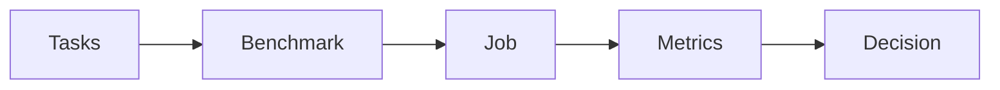

# Benchmarks

A Benchmark is a versioned collection of Tasks. It pins the cases you care about so every Agent is measured on the same work.

You do not score a Benchmark by hand. You create the collection, run a Job against it, then read four metrics: correctness, consistency, latency, and cost. The usual decision is a Pareto of cost and correctness: keep the agents that are accurate enough, then prefer the cheaper ones.



## Create a Benchmark

Start from Tasks you already have. Each Task is one case: instructions, an Environment, and the Verifiers that define success. See [Tasks](tasks.md) if you still need to write those cases.

```python
from plural import Agent, Benchmark, Job

benchmark = Benchmark(
    name="support-triage",
    version="1.0.0",
    description="Categorize, answer, and resolve common support requests.",
    tasks=[ticket_1, ticket_2, ticket_3],
)

careful = Agent(
    name="careful",
    model="openai/gpt-5.6-luna",
    instructions="Read the ticket and policy before assigning a category.",
)
concise = Agent(
    name="concise",
    model="openai/gpt-5.6-luna",
    instructions="Complete the ticket using the available actions. Be concise.",
)

job = Job(benchmark, agents=[careful, concise], attempts=2, concurrency=2)
```

That is the whole setup: group the Tasks, choose the Agents, and attach them to a Job. Task names must be unique. The version is required; change it when the cases or scoring change.

If the Tasks already live in files, load them instead of repeating the constructors:

```python
from plural import Benchmark
from plural.project import load

benchmark = Benchmark(
    name="support-triage",
    version="1.0.0",
    tasks=[
        load("tasks/ticket-1.yaml"),
        load("tasks/ticket-2.yaml"),
        load("tasks/ticket-3.yaml"),
    ],
)
```

YAML describes the same collection:

```yaml
kind: benchmark
name: support-triage
version: 1.0.0
primary_metric: reward
tasks:
  - tasks/ticket-1.yaml
  - tasks/ticket-2.yaml
  - tasks/ticket-3.yaml
```

`primary_metric` defaults to `reward`. That is the correctness score written by each Task's Verifiers. Leave it as `reward` unless you have a named Verifier score you want to rank on.

Choose cases that represent the decisions you need to make. For customer support, include billing, technical, and account requests, then add the difficult ones that matter to your product. A small set checks that evaluation works; a representative set is what you use to choose an agent.

## Run the Benchmark

The Job expands into Trials: every Agent attempts every Task, once per `attempts` value. Three Tasks, two Agents, and two attempts create twelve Trials.

```bash
plural validate job.py:job
plural run job.py:job --dry-run
plural auth login
plural run job.py:job
```

You can also point the CLI at the Benchmark and pass Agents on the command line:

```bash
plural run benchmark.py:benchmark \
  --agent agents/careful.yaml \
  --agent agents/concise.yaml \
  --attempts 2 \
  --concurrency 2
```

A dry-run prints the plan without calling a model. Live runs use your configured account and can incur charges.

In Python, `job.run()` returns the same results the CLI writes to the local store:

```python
result = job.run()
for row in result.aggregates:
    print(
        row.agent_name,
        row.mean_reward,
        row.total_cost,
        row.mean_latency_seconds,
    )
```

## Read the four metrics

Every completed Trial records a score, whether later attempts agree, how long it took, and what it cost. Read them together. An overall average hides the tradeoffs.

### Correctness

Correctness is the Verifier reward. For a support ticket, that is usually 1 when the agent assigned the right category, drafted a reply, and resolved the ticket, and 0 otherwise. The Benchmark ranks Agents on `primary_metric`, which defaults to this reward.

A Trial can finish executing and still score 0. Completing the run is not the same as doing the work correctly.

### Consistency

`attempts` repeats each Agent × Task pair as independent Trials. Two attempts is enough to see whether a score is stable. If an agent solves a ticket once and fails the same ticket the next time, the mean reward is hiding unreliable behavior.

Do not use retries for this. Retries recover a failed execution; attempts are the repeated samples you compare.

### Latency

Latency is how long the Trial took. The Job aggregate is mean latency in seconds. Use it to catch agents that get the answer by taking many more turns, or models that are too slow for the workflow.

### Cost

Cost is measured model usage in USD when the runner can attribute it. The Job aggregate is total cost for that Agent across the Benchmark. Cheaper is only useful if the agent is also correct.

### Cost and correctness together

The comparison people actually make is a Pareto of cost and correctness.

An agent is on the frontier when no other agent is both more correct and cheaper. A slightly more expensive agent is worth it only when it is also more correct. A cheaper agent that fails the cases you care about is not a win.

A common rule:

1. Set a correctness floor for the workflow, such as a mean reward you will accept.
2. Drop every agent below that floor.
3. Among the agents that remain, prefer lower cost. Use latency as the tie-breaker when two agents cost about the same.

Look at the same tradeoff per kind of Task. An agent may be cheap and correct on account questions, then expensive and wrong on billing. The Benchmark average will not tell you that.

## Understand the results

Start with the Job, then one Task, then one Trial.

```bash
plural job list
plural job show JOB_ID
plural trial list JOB_ID
plural trial watch TRIAL_ID --job JOB_ID
```

`job show` prints the aggregates: mean reward, successes, total cost, and mean latency for each Agent. `trial list` shows the per-case scores behind those averages.

When a score is surprising, open that Trial under `.plural/jobs/JOB_ID/trials/TRIAL_ID/`:

1. **Trajectory:** what the agent saw, which actions it took, and the feedback it received.
2. **Final State and Observation:** what actually changed in the Environment.
3. **Verifier results:** which checks passed and the evidence behind the reward.
4. **Receipt:** which Agent, Task, and Runtime produced the result.

For a misrouted ticket, inspect whether the agent skipped the policy, misunderstood it, chose an invalid action, or stopped early. These traces explain the observed score. They do not reveal every internal reason a model made its decision.

Local runs stay in the local store unless you submit or synchronize them. Plural Intel can show the same Job as a leaderboard when that evidence is available there.

## Use the findings

Keep the Tasks and scoring stable while you compare Agents. When you add cases, change a Verifier, or edit the Environment, publish a new Benchmark version so earlier results keep their meaning.

Use recurring failures to improve instructions, the Harness, or the Environment, or to decide that the work needs [training](../running/training.md). When an agent meets the correctness floor at an acceptable cost, apply that choice in [routing](../reference/integrations.md#route-after-evaluation).
