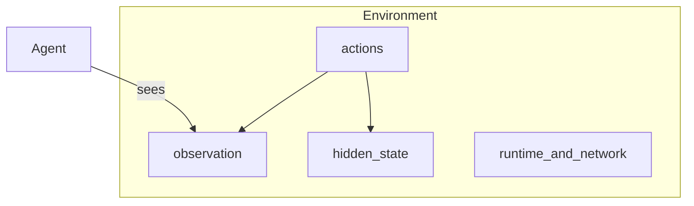

# Environments

An Environment is the world. Tasks pick work inside it. Agents visit. Verifiers score after. The Environment does not own Tasks, Verifiers, or eval-versus-train.

```bash
plural env init environment --name tickets
```

That creates `environment.yaml`, `environment.py`, and a `Dockerfile`. Jobs load the YAML. Put rules in the Python file and expose them as commands.



## The world you author

A filled-in Environment declares:

- **README and overview** — what this world is.
- **Actions** — `reset`, `guess`, `close_ticket`. Each action is a command. Stdin is one JSON object. Stdout is one JSON object.
- **Observation** — what the Agent may see. Never copy the secret here.
- **State** — the episode, including hidden fields. Mark those fields `x-plural-hidden: true` on `state_schema`.
- **Rewarders** — train-only. Eval Jobs ignore them.
- **Resources** — files the Trial can read, like a dictionary.
- **Guardrails** — plain-language rules for humans and models.

Wordle keeps answers in `environment.py`, not on the Task:

```python
SECRETS = {
    "easy-01": "slate",
    "easy-02": "crane",
}
```

The `reset` action loads the secret for a `task_id`. The observation is the board.

## Runtime, network, and limits

Runtime belongs on the Environment, not the Job.

```yaml
runtime:
  provider: local
  network: full
  allow_unsafe_local: true
  targets: [local, docker, remote]
  timeout_seconds: 180
limits:
  max_turns: 6
  max_seconds: 180
```

`local` is the laptop path and needs `allow_unsafe_local: true`. `docker` and remote providers isolate the Trial. `network: none` is a sealed world; `full` and `restricted` are the other knobs. Secrets are named references, never values in the YAML.

## Harness policy

The Environment may forbid **harness** tools. It does not wrap the model. A denied tool is a soft deny: the Agent is told why, and the Trial continues. Environment actions stay available.

```yaml
harness_policy:
  mode: allowlist
  denied_capabilities: [web_search]
```

What this unlocks: every Task that pins this revision plays in the same world, whether the Agent is a constraint solver or a hosted model. Next, [pin work to a Task](tasks.md).
