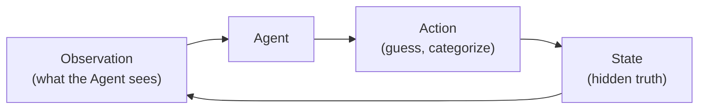

# Environments

An **Environment** is the world an AI works in. It decides what the Agent can see,
which moves it can make, and how each move changes the world. You build it once and
reuse it for many assignments, so every Agent is tested on the same terms.

Think of a game of Wordle. The game is the Environment: you can submit a guess, you
see green, yellow, and gray tiles after each one, and the secret word stays hidden.
Each secret word is a separate [Task](tasks.md), one assignment in that world.

A support desk works the same way. The Environment holds the tickets and the support
policy, and lets the Agent categorize a ticket, draft a reply, and resolve it. Each
Task picks one ticket. A [Verifier](verifiers.md), the grader, then checks whether
the work was done correctly.

## How an Environment works

Every Environment is built from a few parts. Here they are for both examples:

| Part | What it means | Wordle | Support desk |
| --- | --- | --- | --- |
| **Actions** | The moves the Agent can make | `guess` | `categorize`, `resolve` |
| **State** | The full truth, including what the Agent must not see | The secret word, the guesses so far | The right category, what has changed |
| **Observation** | What the Agent is shown | The colored tiles | The ticket and the policy |
| **Resources** | Files already in the world | A word list | A policy document |
| **Runtime** | Where the world runs | Your own machine in the tutorial; a sealed Docker container for code you don't trust | The same |

The Agent plays in a loop. It reads the Observation, picks an action, and the
Environment updates its State and shows a new Observation. That repeats until the
work is done or a budget runs out.


```mermaid
flowchart LR
  obs["Observation<br/>(what the Agent sees)"]
  agent[Agent]
  act["Action<br/>(guess, categorize)"]
  state["State<br/>(hidden truth)"]
  obs --> agent
  agent --> act
  act --> state
  state --> obs
```

> **Good to know:** The Agent only ever sees the Task's instructions and the
> Observations. It never sees the State, a score, or a reward.

Two optional extras build on this. **Rewards** give small bits of credit for
individual moves when you train a model; they are never part of a score. **Secrets**,
such as an API key for a tool, are declared by name on the Environment and supplied
only when a run starts.

## Start with the work you want to measure

Before writing code, answer five questions:

1. **What should the Agent accomplish?** Choose one workflow, such as resolving a support ticket.
2. **What information would it have?** Show it the ticket and the policy that applies.
3. **What can it do?** Define a few focused actions that match the real workflow.
4. **How will you know it succeeded?** Keep the expected outcome where a Verifier can read it.
5. **When should it stop?** Decide what counts as finished, and set a turn and time budget. See [How an episode ends](#how-an-episode-ends).

Start small. Add cases and complexity once you can explain why a known good run
passes and a known bad run fails.

## Actions, State, and Observation

These three parts describe the interaction:

- **Actions** are the operations the Agent can call, such as `categorize` or `resolve`.
- **State** holds the internal data: the expected answer and every change made during the run.
- **Observation** holds the information you choose to show the Agent.

After each action, the Agent sees the Environment's current `self.observation` and
nothing else. An action's return value goes to reward signals but is never shown to
the Agent. So update `self.observation` with what the Agent should see, and never copy
State into it. A Verifier can read the final State to check the result.

This split controls what Plural shows the model. It is not a security boundary; when
you run code you don't trust, use Runtime isolation as well. See [Runtime](#runtime).

## Define the Environment

An Environment is a Python class. This small example lets an Agent sort one support
request into the right team:

```python
from plural import Environment, Observation, Runtime, State, action, initial


class TicketObservation(Observation):
    issue: str = "I was charged twice."
    category: str = ""
    done: bool = False

    def render(self) -> str:
        return f"{self.issue}\n{self.text}\nCategory: {self.category or 'unassigned'}"


class TicketState(State):
    expected: str = initial("billing", description="The category this ticket should receive.")
    category: str = ""
    done: bool = False


class TicketTriage(Environment[TicketObservation, TicketState]):
    name = "ticket-triage"
    overview = "Assign a support request to the right team."

    def reset(self, *, seed=None, options=None):
        super().reset(seed=seed)
        self.state = TicketState(seed=self.state.seed)
        self.observation = TicketObservation(text="Choose billing, technical, or account.")
        return self.observation, {}

    @action
    def categorize(self, category: str) -> TicketObservation:
        """Assign the ticket to billing, technical, or account."""
        if category not in {"billing", "technical", "account"}:
            raise ValueError("Choose billing, technical, or account")
        self.state.category = category
        self.state.done = True
        self.observation.category = category
        self.observation.done = True
        return self.observation

    def terminated(self) -> bool:
        return self.state.done


environment = TicketTriage(runtime=Runtime.local())
```

Reading it from the top:

- `TicketObservation` is what the Agent sees. `render()` turns it into the text the
  model reads.
- `TicketState` is the hidden truth. `expected` is marked with `initial()`, so a Task
  can set it.
- `reset` starts a fresh attempt. `categorize` is an action, marked with `@action`.
- `terminated` tells Plural the ticket is done.

`runtime` is a required Environment parameter. It selects where the Environment and
the Agent run. This example uses your own machine, which is fine for trusted
development.

The Job, the run you start, calls `reset` to begin each attempt and then invokes the
actions the Agent picks. Only Agent-facing methods use `@action`; `reset` and `step`
are lifecycle methods. Typed action parameters tell the model which inputs each action
accepts, and clear docstrings help it use them well. When an action raises
`ValueError`, the Agent sees the message and the episode continues, so it can fix its
input and try again.

The directory that contains the class is its source package. Keep the code and data it
needs there, and keep credentials, caches, and generated results elsewhere. Plural
records the source hash and copies the package into the Runtime.

## Save the Environment in a project

In a project, an Environment is a folder under `environments/`, named after the
Environment. Create one from the standard template:

```bash
plural env init ticket-triage
```

```text
environments/ticket-triage/
├── environment.yaml
├── environment.py
└── README.md
```

The class lives in `environment.py`, and the folder is its source package. Add a
`resources/` folder beside them when the Environment needs data files.
`environment.yaml` holds everything else: its name, resources, Runtime, and settings.
This is the manifest from the [first project](../tutorials/first-project.md):

```yaml
name: support-queue
version: 1.0.0
description: A customer support queue with one open ticket per Task.
overview: Inspect a customer ticket, categorize it, draft a reply, and resolve it.
python: environment.py:SupportQueue
readme: README.md
resources:
  - resources/policy.md
runtime:
  provider: local
harness_policy:
  mode: allow_all
limits:
  max_turns: 6
  max_seconds: 120
```

What each field means:

- `name` must match the folder name. The name and overview come from the manifest, so
  the class does not need `name` or `overview` attributes.
- `python` names the Environment class as `file.py:Class`.
- `readme` points to `README.md`, which explains the actions, State, Observation,
  rewards, and settings to the people who use the Environment.
- `resources` lists files to stage, relative to the folder. A path is the
  [short form](#the-short-form); a mapping takes the same fields as `Resource`.
- `runtime` picks a provider with `provider`, such as `docker`, `local`, or
  `daytona`. The other keys are that provider's settings, such as `image` or `cpus`;
  `plural runtime provider <provider>` lists them. The template uses `docker` with the
  `python:3.12-slim` image. To reuse a project [Runtime](runtimes.md), run
  `plural runtime use <runtime> <environment>`, which fills this block in for you.
- `harness_policy`, `limits`, `secrets`, `guardrails`, and `metadata` take the same
  values as the Environment arguments of those names.

Every path must stay inside the Environment folder. Check the Environment, then save
it to your hosted project:

```bash
plural env validate ticket-triage
plural env push ticket-triage
```

A push saves an unchangeable revision that stays private to the project. It refuses
files that look like credentials and paths that escape the folder. To leave out other
files, list them in a `.pluralignore` file in the Environment folder. Credentials are
never stored in the project; you supply them when the Job runs, as described in
[Runtime variables and secrets](#runtime-variables-and-secrets).

## How an episode ends

An **episode** is one play-through, from `reset` to the end. Every Agent action goes
through `step`, which returns the same five values Gymnasium uses:

```python
observation, reward, terminated, truncated, info = environment.step("categorize", category="billing")
```

The Agent only ever sees the observation. The other values describe what happened,
and Plural records them on the episode instead of showing them to the model, so a
reward or an end-of-game flag never leaks into the model's context.

An episode can stop for three reasons. Each records a different `stop_reason` on the
Trial, the record of one attempt. The full set of values is `plural.STOP_REASONS`.

- **The Environment ends it.** Override `terminated()` when the world reaches a
  success or failure state for the Task, as the example above does once the ticket is
  categorized. Override `truncated()` when the episode can't usefully continue but
  reached neither outcome. Both default to `False`, so an Environment that never
  overrides them leaves the decision to stop entirely to the Agent and the budget.
- **The Agent ends it.** Plural adds a `finish` tool alongside your actions. The Agent
  calls it when the work is done or when it can't make progress, and its optional
  `summary` becomes the Trial's response. Declare an `@action` named `finish` if you
  would rather handle that yourself.
- **A budget cuts it short.** `max_turns`, `max_seconds`, and `max_cost_usd` truncate
  the episode instead of failing the Trial, so you still get a trajectory and Verifier
  results.

`terminated` and `truncated` are recorded separately from `stop_reason`, because
neither is set when the Agent chose to stop. Read `stop_reason` to tell an Agent that
finished early from a world that declared the Task over.

## Rewards

A **reward** is a small bit of credit for one move. It answers "which action deserved
the credit?", which is what a training system needs. Verifiers answer a different
question: did the attempt succeed? Rewards are recorded on the episode in every mode,
and they never count toward a score.

For a single signal, override `reward`:

```python
class TicketTriage(Environment[TicketObservation, TicketState]):
    def reward(self, previous_state, current_state, action, result) -> float:
        return 1.0 if current_state["category"] == current_state["expected"] else 0.0
```

For several named signals, declare a `@rewarder` for each. Every one runs inside
`step`, right after the action that changed the world, and `weight` scales its
contribution:

```python
from plural import rewarder


class TicketTriage(Environment[TicketObservation, TicketState]):
    @rewarder(weight=2)
    def correct_category(self, previous_state, current_state, action, result) -> float:
        return 1.0 if current_state["category"] == current_state["expected"] else 0.0

    @rewarder
    def progress(self, previous_state, current_state, action, result) -> float:
        return 1.0 if current_state["category"] and not previous_state["category"] else 0.0
```

The precise rules:

- Every reward signal takes exactly `previous_state, current_state, action, result`.
- The two states are detached JSON snapshots taken before and after the action, so
  read them like dictionaries rather than as your `State` class.
- `action` is the action name plus its parameters, and `result` is whatever the action
  returned.
- The `reward` returned by `step` is the weighted total of `reward()` and every
  rewarder, and `info["rewards"]` breaks that total down by name.
- A signal that raises is recorded as `0.0`, with its error in that breakdown, because
  a bug in a reward must not fail an action that already changed the world.

A trainer reads these per-step values; see [Training and RL](../running/training.md).

## Connect Tasks and scoring

The example above always uses the same ticket. For a useful benchmark, reuse the
Environment with different case data. Each [Task](tasks.md) supplies instructions,
picks its case, and attaches one or more [Verifiers](verifiers.md).

Use `reset` to load the chosen case and clear earlier progress. A few rules decide
what a Task can pass in:

- Task `info` is public, so it can hold a ticket ID but should not hold the answer key.
- `initial_state` supplies schema-checked setup data. Your `reset` must preserve any
  fields it needs.
- Mark those State fields with `initial()`. Pass constraints such as `min_length=5` or
  `pattern=r"^[a-z]{5}$"` when a Task's value must match a rule.
- Unmarked fields, such as `done` or a running list of guesses, belong to the episode,
  and a Task cannot set them.
- `State.seed` is settable. `State.metadata` is not.
- Plural stores a Task's `reset_options` but does not yet pass them to `reset`, so
  load case data through `initial_state` instead.

The [support queue tutorial](../tutorials/support-queue.md) shows how the Environment
loads the Task's ticket and scores the finished workflow.

## Display views

A view is what *people* see when they watch a run in the run viewer. It is separate
from the Observation, which is what the model sees. Override `view()` to control it.
Plural records the view after the reset and after every step, for display and replay
only. It never reaches the Agent, and it is not scored.

A view is plain data, not code. It declares a `schema` and a `kind` that the viewer
knows how to draw, so a run can never ship its own rendering script:

```python
def view(self):
    return {
        "schema": "plural.view/v1",
        "kind": "marks-grid",
        "title": "Wordle",
        "columns": 5,
        "max_rows": 6,
        "rows": [{"letters": "crane", "marks": ["absent", "present", "correct", "absent", "absent"]}],
        "status": "5 guesses left",
    }
```

Version 1 defines these kinds:

- `marks-grid` draws `rows` of `letters`, each letter marked `correct`, `present`, or
  `absent`, with an optional `title`, `columns`, `max_rows`, and `status`.
- `markdown` shows `markdown` as plain text.
- `key-values` shows `items`, a list of `{"label": ..., "value": ...}` pairs.

The viewer shows any other view, or one it can't read, as formatted JSON beside the
observation.

> **Good to know:** Everyone who can read the run can see its view, the same as
> the observation. Leave out anything that people with read access should not see. The
> Wordle example shows guesses and marks, never the secret word.

## Runtime

The **Runtime** is where the world runs: a sealed container, your own machine, or a
remote machine. Choose one based on where the code should run and which controls you
need. Plural checks support before running and fails if the chosen provider can't
enforce a control you asked for.

In short:

- **Local** runs on your computer. Use it only for code you trust.
- **Docker** runs in a sealed container on a machine with Docker installed.
- **Remote** runs on a machine from a remote provider. The bundled provider is Daytona.

### Local

```python
Runtime.local()
```

Use this for trusted development. Plural runs a subprocess in a temporary workspace
on your machine. Local execution does not provide a sandbox, network isolation, or
compute limits. `Runtime.local()` explicitly enables local execution through
`allow_unsafe_local`.

### Docker

```python
Runtime.docker()
Runtime.docker(image="my-org/eval:1")
Runtime.docker(cpus=2, memory_mb=2048, read_only_root=True)
```

Use Docker for container isolation on a machine with Docker installed. The default
image is `python:3.12-slim`. The workspace stays writable when the root filesystem is
read-only. Pin an image digest when you need reproducible system dependencies.

To install more dependencies, put a Dockerfile beside the Environment:

```dockerfile
FROM python:3.12-slim
WORKDIR /workspace
COPY requirements.txt .
RUN pip install --no-cache-dir -r requirements.txt
```

```python
Runtime.docker(dockerfile="Dockerfile", build_context=".")
```

`build_context` is the folder Docker uses for the build. Builds time out after 600
seconds by default. Choose one image source: a registry image, a snapshot, a
declarative image, or a Dockerfile.

### Remote

Use a remote Runtime to run away from your machine. The bundled provider is Daytona.
Install the remote integration and set `DAYTONA_API_KEY`:

```bash
python -m pip install "plural[daytona]"
```

```python
Runtime.daytona(image="python:3.12-slim")
```

Remote execution needs an image or snapshot the provider can reach. It can't build
from a Dockerfile on your laptop. See
[Providers and integrations](../reference/integrations.md) for setup and extensions,
and [Runtimes](runtimes.md) to set up a Daytona sandbox once and reuse it across
Environments.

### Network

Model calls run inside the Runtime, so it needs to reach the model endpoint. Choose
the narrowest network access that still supports your workflow:

- `public` allows outbound connections, and is the default.
- `no-network` blocks outbound connections.
- `allowlist` permits only the hosts listed in `allowed_hosts`, on a provider that
  supports it.

Local execution can't isolate networking. Docker can block outbound traffic but does
not enforce a host allowlist. The remote provider supports allowlists:

```python
Runtime.daytona(
    image="python:3.12-slim",
    network="allowlist",
    allowed_hosts=("api.openai.com",),
)
```

Use your actual model endpoint hostname. Verifiers have their own `VerifierRuntime`;
model judges also need to reach their endpoint.

### Compute, timeouts, and persistence

`cpus` and `memory_mb` request compute limits on providers that support them. The
Runtime's `timeout_seconds` defaults to 300 seconds for execution and upload
operations. Environment limits separately bound the episode:

```python
from plural import ExecutionLimits

environment = TicketTriage(
    runtime=Runtime.local(),
    limits=ExecutionLimits(max_turns=4, max_seconds=60),
)
```

The default episode limits are eight turns and 120 seconds. An optional `max_cost_usd`
sets a cost budget, based on the usage the runner can measure.

Local, Docker, and the bundled remote provider do not keep workspaces between Trials.
Recreate the data each Trial needs in `reset`.

## Resources

**Resources** are the files and data the world starts with, like the Wordle word list
or the support policy. Environment resources are shared by every Task; Task resources
belong to one case, such as a single customer's invoice. Each Trial gets a fresh copy
of both:

```text
/workspace/resources/
  shared/             # Environment inputs
    policies/refunds.md
  task/               # Inputs for this Task only
    invoice.csv
  manifest.json       # File locations and SHA-256 hashes
```

Use relative file paths. Task files never replace shared files, even when their names
match. Environment code reads the root folder from `PLURAL_RESOURCES_DIR`, then shows
the right information through actions or observations.

> **Good to know:** Files are not added to the model's prompt automatically. The Agent
> only learns what your code puts in the Observation.

There are four ways to supply a resource. The short form covers most cases; the rest
are for power users.

### The short form

A file that already lives next to your Environment code needs one line. Plural stages
it from the source package automatically:

```python
from plural import Resource

policy = Resource("policies/refunds.md")
```

That is `kind="file"` and `delivery="source"`, with the name defaulting to the path.
Pass `resources=[policy]` when you create the Environment. In `environment.yaml`, list
the same path under `resources`.

### Saved text and configuration

To keep a small text file with the Environment itself, pass its content:

```python
from plural import Resource

policy = Resource(
    "policies/refunds.md",
    content="Refund duplicate charges after confirming the invoice.",
    content_type="text/markdown",
)
```

Pass `resources=[policy]` when you create the Environment. Plural calculates the
content hash and writes the file before reset. Inline resources support text, CSV,
JSON, and other UTF-8 configuration, up to 1 MiB of characters and the 16 MiB
staged-file limit. They are stored with the Environment, so use runtime secrets for
credentials.

### Packaged files

The short form already stages a file from the Environment's source package into the
resource folder. The explicit mapping form says the same thing:

```python
policy = Resource(
    kind="file",
    name="policies/refunds.md",
    path="policies/refunds.md",
    delivery="source",
)
```

The path must point to a file inside the package. Source files may be binary. Each
staged file is limited to 16 MiB. The manifest records the actual hash; an optional
`digest` requires an exact match.

### Data resolved at launch

For data that lives elsewhere, such as in your ticketing system, store its location,
a resolver name, configuration, and the expected hash. Then give the Job the resolver
that fetches it:

```python
import hashlib
from plural import Job, Resource

expected_bytes = b'{"ticket_id": "ticket-123", "category": "billing"}'
ticket = Resource(
    kind="data",
    name="ticket",
    path="ticket.json",
    delivery="resolver",
    uri="support://tickets/ticket-123",
    resolver="support-ticket",
    config={"ticket_id": "ticket-123"},
    digest="sha256:" + hashlib.sha256(expected_bytes).hexdigest(),
)

def load_ticket(resource: Resource) -> bytes:
    # Replace this fixture with a read from your data service.
    # Set a timeout on external calls and return a stable encoding.
    assert resource.config["ticket_id"] == "ticket-123"
    return expected_bytes

# Add ticket to the Task's resources before creating this Job.
job = Job(task, agents=[agent], resource_resolvers={"support-ticket": load_ticket})
```

The rules:

- Resolvers run in the Job process before the Agent starts. They receive the resource
  declaration and return bytes.
- Plural rejects missing resolvers and mismatched hashes.
- Register resolvers in the process that runs the Job. Naming a resolver in a manifest
  or in the web app does not install it for hosted runs.
- A URI alone is never fetched automatically.

A `Resource` declared with explicit fields and no `delivery` is a `descriptor`: Plural
records the reference but stages no file, and your Environment code must load the data
itself.

## Runtime variables and secrets

Some Environments need settings or credentials, such as the address of a support API
and a token for it. You declare their **names** on the Runtime, and supply the actual
**values** only when you start a Job. That way no credential is ever saved with the
Environment.

```python
import os
from plural import Job, Runtime, RuntimeVariable

runtime = Runtime.docker(variables=[
    RuntimeVariable(
        name="SUPPORT_API_URL",
        format="url",
        description="Base URL of the support API.",
    ),
    RuntimeVariable(
        name="SUPPORT_API_TOKEN",
        secret=True,
        description="Token with access to the evaluation support account.",
    ),
])

# Use this runtime when constructing your Environment and Task.
job = Job(task, agents=[agent], environ={
    "SUPPORT_API_URL": os.environ["SUPPORT_API_URL"],
    "SUPPORT_API_TOKEN": os.environ["SUPPORT_API_TOKEN"],
})
```

The precise rules, for anyone wiring up credentials:

- Required declarations must have a nonempty value. Set `required=False` for optional
  inputs.
- Supported formats are `text`, `url`, `integer`, and `json`.
- Values are injected into the Environment's reset and action commands. Declarations
  never contain values.
- The Harness, the loop that drives the Agent, shares the Runtime and can read these
  variables, so use trusted Harness code.

`Secret` references are also injected according to their `environment`, `harness`, or
`verifier` target. Environment secret references as metadata declare names and targets
only; values are supplied when the Job runs and are never stored on the Environment.
Verifier credentials are supplied to the scoring process. Managed stdout and stderr
redact declared secrets, but Environment code must avoid writing credentials into
observations or custom artifacts.

Docker and Daytona connection credentials configure the machine that runs the Job,
separately from these Task variables. Plural checks that the provider is available and
supports the requested controls when a run starts.

Model calls are authenticated through the Job's `client` or `api_key` parameter. Every
model call goes through the Plural gateway, so `plural run` needs a Plural API key:
one stored with `plural auth login` or `plural auth login --api-key-stdin`, or an
exported `PLURAL_API_KEY`.

## Optional components

- **Metadata:** use `name`, `version`, and `overview` to identify the Environment; use
  `metadata` for labels and ownership.
- **Display:** override `Observation.render()` to control the text the model reads, and
  `Environment.view()` to control what people see in the run viewer. See
  [Display views](#display-views).
- **Harness policy:** limit which custom Harnesses may run here and what they may do.
  See [Harnesses](harnesses.md).
- **Rewards:** attach per-step credit to state changes. See [Rewards](#rewards).

## Build a complete example

Continue with [Tasks](tasks.md) to add cases to your Environment, or follow an
end-to-end tutorial:

- [Support queue](../tutorials/support-queue.md): inspect, categorize, answer, and resolve three tickets.
- [Wordle](../tutorials/wordle.md): guess a hidden word using feedback from one action.
