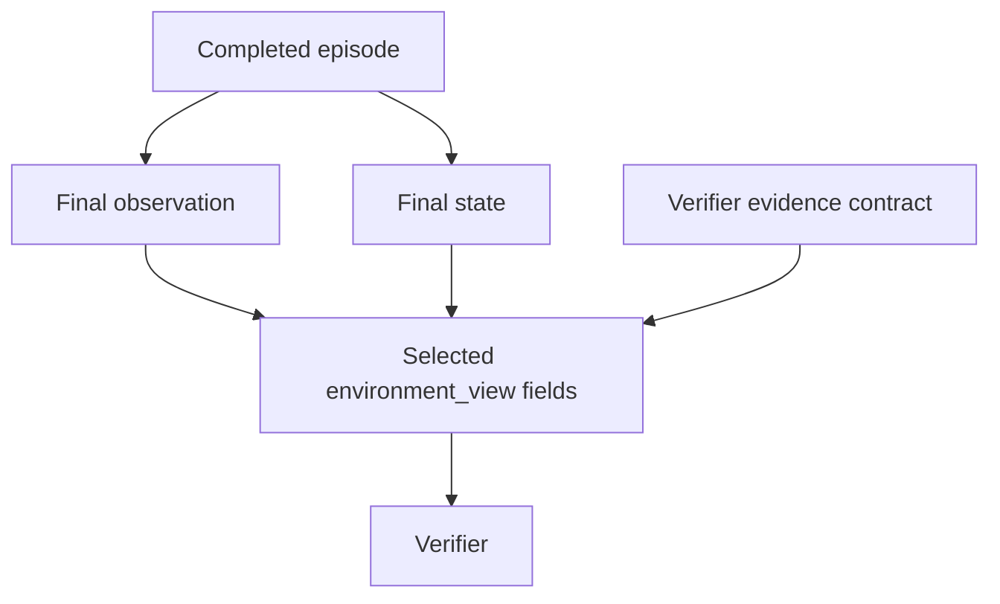

# Evidence and hidden state

A score is useful when you can explain what it was based on. A Verifier's evidence contract names the information it expects from the episode. It also lets Task validation catch incompatible Environment and Verifier definitions before a Job starts.

## Declare the view

```yaml
evidence:
  observation_paths: [category, done]
  state_paths: [expected]
  include_hidden_state: true
```

In this example, `environment_view.observation` contains `category` and `done`; `environment_view.state` contains `expected`. Request only fields the verifier needs. Hidden state is not copied into the Agent's public Task payload by this contract.



## Use supported paths

`category` and `/category` identify the same top-level field. Nested object fields use JSON Pointer syntax, such as `/customer/status`; `~1` escapes a slash in a key and `~0` escapes a tilde. Current path validation walks schema object `properties`, not arbitrary array-index or wildcard expressions.

The current filtered view uses the **last path segment as the output key**. `/customer/status` becomes `environment_view.observation.status`. Avoid selecting two paths with the same final name, because their output keys would collide. Request an appropriate parent object or choose unambiguous fields.

A selected parent object includes its value as a whole. Keep sensitive nested fields out of public objects instead of assuming this path selector recursively redacts every child. Marking and requesting hidden fields must agree with your Environment's actual structure.

## Know when checks happen

When a Task loads, Plural checks that requested observation and state paths exist in the Environment schemas. A requested hidden state path requires `include_hidden_state: true`.

At execution, the deterministic verifier checks required artifact names against the produced artifacts. The runner builds the view from final observation/state data and supplies the verifier input. A schema declaration does not guarantee that a field was emitted at runtime; missing values may be absent from the view. Make a missing required value fail explicitly in your scorer.

`evidence_required: true` on a deterministic verifier also requires a nonempty `evidence` list in its result. That is separate from declaring artifact names.

## Artifacts and trust boundaries

The runner stages captured artifacts under `artifacts/` in the scoring workspace. The input payload includes their paths along with the Task's public payload and optional trace ID.

**The evidence contract filters `environment_view`; it is not an artifact filesystem access-control list.** The current command verifier runner stages all captured artifacts. Do not use the contract alone to isolate an untrusted verifier from sensitive files. Use a suitable execution boundary and control what artifacts the run captures.

Likewise, the schema's hidden-state marker prevents neither a custom harness from leaking an answer nor a shell from reading a colocated file. Keep the agent's tools, shared workspace, and model messages consistent with the information boundary you intend.

## Keep feedback shareable

A verifier can inspect private state and still produce feedback that is safe to show more broadly. Write “refund total matches policy” instead of copying an entire customer record. Keep raw private evidence in its intended storage and share only the derived explanation needed to understand the score.

See [Traces](../running/traces.md) for inspecting artifacts and [Reviews](../running/reviews.md) for applying the same scoring standard with a person.
