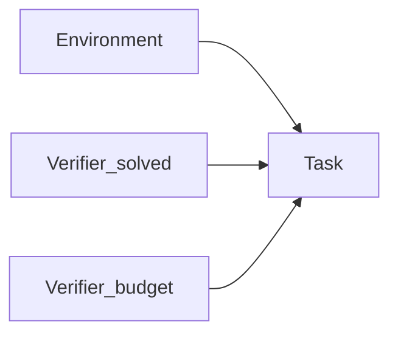

# Tasks

A Task is one piece of work. It does not contain the world. It points at one Environment revision and one or more Verifiers, then tells the Agent what to do in public language.

```bash
plural task init task.yaml --id ticket-1 \
  --environment environment --verifier verifier.yaml
```

```yaml
schema_version: "2"
task_id: easy-01
revision: "1.0.0"
instructions: >-
  Solve Wordle puzzle Warm-up. Submit valid 5-letter guesses. You have 6
  attempts. Do not expect the answer to appear in the Task.
environment: ../environment
verifiers:
  - ../verifiers/solved.yaml
  - ../verifiers/budget.yaml
verifier_weights: [1.0, 0.5]
info:
  letters: 5
  max_attempts: 6
  label: Warm-up
```

The same object in Python is `TaskDefinition`. `plural task validate` loads the YAML, resolves the Environment and Verifiers, and refuses the pin if a Verifier asks for evidence the Environment cannot provide.



## What the Agent may see

`instructions` and `info` are public. Put difficulty labels and UI copy there. Do not put the answer, the customer record, or anything you marked hidden on state.

Wordle Task ids are `easy-01`, not `slate`. The secret stays in the Environment. Verifiers that need it ask for `state_paths: [secret]` and `include_hidden_state: true`. That is a Verifier privilege, not a Task field.

## Pin-time is fail-closed

When you pin a Verifier, Plural checks the evidence contract against the Environment schemas. A missing artifact name or a path that is not on observation or state fails the Task. You find out when you validate, not after a Job has already run.

Weights are relative. `1.0` and `0.5` means the solved score counts twice the efficiency score when the Job rolls them up.

What this unlocks: you can add a Task to a second Environment by writing another file. The Agent does not change. Next, [write the score](verifiers.md).
