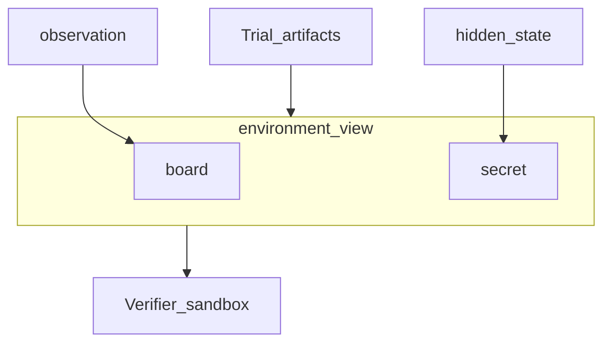

# Verifiers

A Verifier answers “did this episode count?” It has its own runtime. It is not the Environment and not the Agent.

```bash
plural verifier init verifier.yaml --name correct --kind deterministic
```

`--kind agent` creates a model judge. `--kind human` creates a rubric that yields `awaiting_review`.

## A command you can read

Put the script next to the YAML. `plural run` inlines `solved.py` so the sandbox executes the file you edit.

```yaml
schema_version: "2"
kind: deterministic
name: wordle-solved
command: [python, solved.py]
runtime:
  provider: local
  network: full
evidence:
  artifacts: [final-observation.json]
  observation_paths: [board]
  state_paths: [secret]
  include_hidden_state: true
```

```python
data = json.loads(Path(".plural/verifier-input.json").read_text())
view = data["environment_view"]
board = view["observation"]["board"]
secret = view["state"]["secret"]
solved = board[-1]["word"] == secret
```

The script writes `verifier-result.json` with `reward`, `scores`, `evidence`, and `feedback`.



## Evidence

`EvidenceContract` lists artifacts and JSON paths. `environment_view` is filtered to those paths. Hidden state enters the view only when `include_hidden_state` is true. The Agent never sees that view. The Verifier sandbox does.

If the Environment schema does not have `board` or `secret`, pinning the Verifier to a Task fails. That is the fail-closed pin from the [Tasks](tasks.md) page.

A human Verifier uses the same evidence. The reviewer sees that view, scores the rubric, and the Trial unblocks. [Reviews](../running/reviews.md) walks that flow.

What this unlocks: you can swap a regex for a model judge or a human rubric without touching the Environment. Next, [give an Agent a Harness](agents.md).
