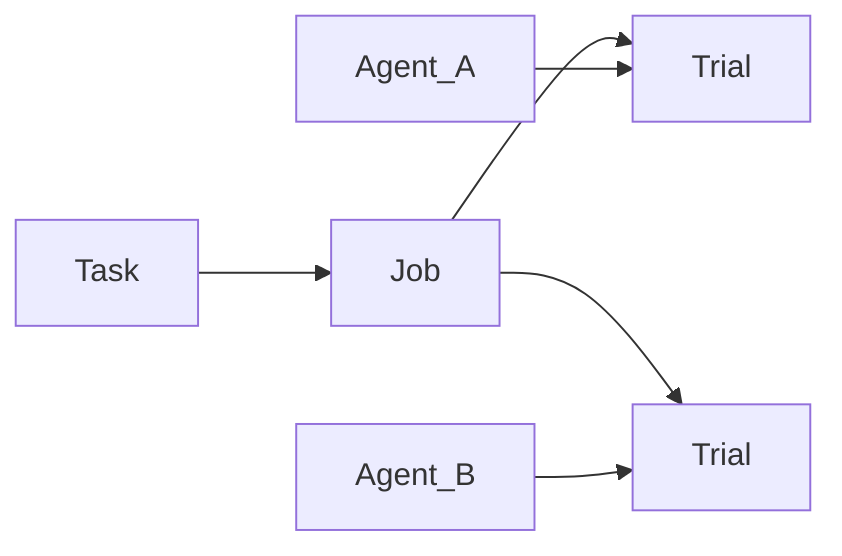

# Jobs

A Job is the orchestration. Source + Agents + mode + attempts. Everything else is already pinned.

```bash
plural job init job.yaml --source task.yaml --source-kind task --agent agent.yaml
plural run job.yaml --dry-run
plural run job.yaml --offline
```

`--dry-run` prints stable Job and Trial ids without launching. `--offline` writes the durable log under `.plural/jobs`. Omit `--offline` to publish revisions and submit a hosted Job.

```yaml
schema_version: "2"
source_kind: task
source: tasks/easy-01.yaml
agents:
  - agents/solver.yaml
mode: eval
attempts: 1
```



A Benchmark source expands the same way: every Agent × every Task × every attempt.

## Eval and train

**Eval** (the default) runs Verifiers and turns Rewarders and TITO capture off. Use it when you want a score.

**Train** keeps Verifiers and also runs Environment Rewarders. Use it when you want a learning signal in addition to the score.

Retries, concurrency, and priority live on the Job. The Environment still decides where each Trial runs.

## The receipt

Each Trial ends with a receipt: status, reward, per-Verifier scores, artifact hashes, capability denials, and a `trace_id`. If a human Verifier is on the Task, status is `awaiting_review` until someone scores it.

What this unlocks: the same `job.yaml` is a local rehearsal and a hosted submission. [Traces](traces.md) is the episode inside a Trial.
