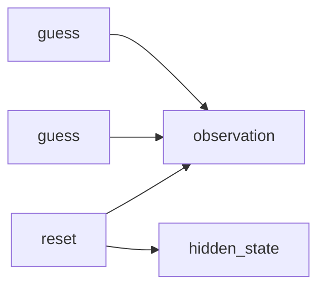

# Traces

A Trace is what happened. Turns, actions, observations, Verifier results, artifact pointers. It is pinned to the exact Environment, Task, Agent, and Verifier revisions from the Trial.

Open a Trace from a local Job under `.plural/jobs`, or open the same Trial in Plural Intel. The board, the guess list, and the rendered text are public. The secret is not. Hidden state never enters `public_payload`. Verifiers that asked for it already received a filtered `environment_view`.

A dataset is an export of Traces or Tasks, not the starting object. Build the world first. Export when you want a frozen set for later training or a shareable eval slice.

What this unlocks: you can replay an episode without re-running the Agent, and you can teach a new Agent from traces you already trust. If a human still has to look, [Reviews](reviews.md) is the pause.
